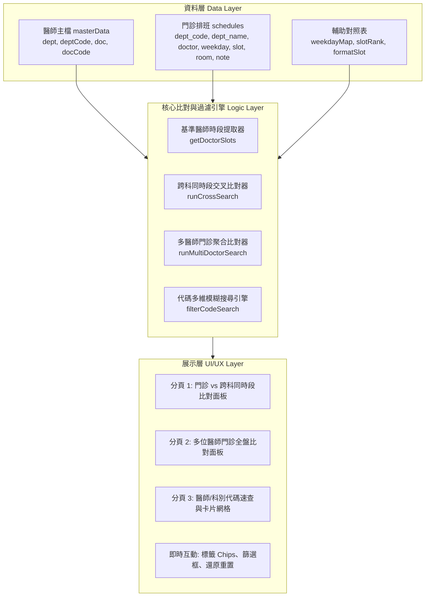

# 門診時段交叉查詢與醫師代碼查詢系統 - 專案紀錄 (Project Record)

---

## 1. 專案基本資訊 (Project Overview)

| 項目 | 內容 |
| :--- | :--- |
| **專案名稱** | 門診時段交叉查詢與醫師代碼查詢系統 (Outpatient Clinic Schedule Cross-Query & Doctor Code Assistant) |
| **專案代號** | `Clinic-Schedule-CrossQuery` |
| **建立日期** | 2026-09-18 |
| **目前版本** | `v1.0.0` (正式升級 3D 浮雕立體金框 App Logo 款式 B 滿版金框版、PWA 獨立視窗與離線秒開) |
| **主要目標使用者** | 臨床醫師、門診跟診護理師、轉診中心個案管理師、批價掛號櫃檯人員、專科護理師 (NP)、各科行政秘書 |
| **運作環境** | 現代網頁瀏覽器 (Chrome, Edge, Safari, Firefox)、支援行動裝置 (RWD)、純前端零依賴離線運作 (Zero-dependency Web App) |
| **GitHub 倉庫** | `https://github.com/DAIDAI082340/OPD-schedule-and-Doctor-code` |
| **GitHub Pages 線上網址** | `https://daidai082340.github.io/OPD-schedule-and-Doctor-code/` |
| **專案路徑** | `c:\Users\X4715G\Desktop\Antigravity 專案\門診時段交叉查詢與醫師代碼查詢系統` |

---

## 2. 專案背景與核心目標 (Background & Objectives)

### 2.1 臨床背景與痛點說明
在大型醫療院所與醫院門診臨床運作中，醫護與行政人員常面臨以下挑戰：
1. **跨科轉診與會診難以即時對照**：
   - 當病人於 A 科就醫需要同日順道轉診或照會 B 科時，門診醫師或跟診人員往往需要翻閱厚重的紙本門診排班手冊或多頁 PDF，逐一核對「在我的門診時段，目標科別究竟是哪位醫師同時段有看診」，對照繁瑣且容易出錯。
2. **多位跨科醫師同日排程協同不易**：
   - 多科聯合會診或患者有多重慢性病需求時，需要協調 2 至 3 位特定醫師的排班重疊日（例如同時掛腎臟科與心臟科、或一般外科與大腸直腸外科），人工跨頁比對耗時費力。
3. **醫囑系統開立代碼翻查緩慢**：
   - 於 HIS 醫療資訊系統開立轉診單、照會單、檢驗檢查或辦理掛號時，需輸入醫師 4 碼代碼（如 0262）與科別代碼（如 AA、08 等），若手邊無即時快查工具，常中斷臨床作業流程。

### 2.2 系統核心目標
1. **某科別醫師門診 vs 其他科別同時段醫師秒級交叉查詢**：
   - 選定基準醫師後，系統立即抓取其每週所有看診時段（星期、上下夜診）。
   - 支援指定單一科別、全科、或多個目標醫師，即時列出同一時段內出診之醫師姓名、代碼、診間與備註。
2. **多位醫師門診全盤比對（依星期直覺聚合）**：
   - 提供多組科別及醫師選單或直接標籤勾選，一次比對 2 位以上醫師之每週排班。
   - 依星期一至六與時段自動聚合，即時標明「同時段看診 (N位)」綠色高亮或「單獨看診」。
3. **科別與醫師代碼雙向即時速查**：
   - 科別代碼快速展現全科醫師名單與代碼。
   - 提供全域關鍵字搜尋（輸入醫師姓名、醫師代碼或科別代碼立即過濾顯示卡片）。
4. **極致輕量、零後端依賴、單檔發行**：
   - 採純前端技術架構（HTML5/CSS3/Vanilla JS），不需架設 Node.js、資料庫或後端伺服器，可直接於院內內網、病房電腦或手機離線雙擊開啟使用。

---

## 3. 現有資產盤點與技術現狀 (Existing Assets & Current Status)

### 3.1 現有檔案清單
| 檔案名稱 | 類型 | 檔案大小 | 狀態與說明 |
| :--- | :---: | :---: | :--- |
| `門診時段交叉查詢與醫師代碼查詢系統.html` | 單檔應用程式 | 約 79 KB (1695 行) | 核心原型。內建完整 UI 介面、三大查詢分頁、`masterData`（86+ 位醫師主檔）與 `schedules`（完整門診排班時段陣列）。 |
| `PROJECT_RECORD.md` | 專案紀錄 | 新建 | 本專案紀錄文件，記錄專案全貌、規格架構、資料字典與演進歷程。 |

### 3.2 現有資料庫涵蓋規模盤點
目前 `門診時段交叉查詢與醫師代碼查詢系統.html` 已整理並收錄完整之科別與醫師主檔：
- **涵蓋科別（共 29 個科別代碼）**：
  - 腸胃內科 (`AA`)、心臟內科 (`AB`)、胸腔內科 (`AC`)、腎臟內科 (`AD`)、免疫風濕科 (`AE`)、血液腫瘤科 (`AF`)、感染科 (`AH`)、神經內科 (`12`)、新陳代謝科 (`0202`)、放射腫瘤科 (`FB`)、家醫科 (`01`)、心臟外科 (`BB`)、胸腔外科 (`BC`)、一般外科 (`03`)、大腸直腸外科 (`BA`)、神經外科 (`07`)、骨科 (`06`)、泌尿科 (`08`)、耳鼻喉科 (`09`)、整形外科 (`15`)、婦產科 (`05`)、高壓氧 (`0208`)、皮膚科 (`11`)、眼科 (`10`)、牙科 (`40`)、復健科 (`14`)、精神科 (`13`)、小兒科 (`04`)、中醫科 (`60`)。
- **醫師主檔 (`masterData`)**：86 筆以上醫師代碼與姓名對應，已校正最新醫師代碼（如 `(0262) 陳詩典`）。
- **門診排班 (`schedules`)**：包含數百個時段記錄，詳載星期（週一至週六）、時段（上午診、下午診、夜診）、診間號（如 `1樓11診`、`2樓88診`、`22診`）與特診備註（如 `肺癌特診`、`限約診`、`9/12.26` 等隔週看診條件）。

### 3.3 現有功能優勢與演進評估 (Gap Analysis)
- **優勢**：
  - 介面採用現代醫療清新色彩風格（深藍、海藍與白底），易讀性佳。
  - 交互功能完整，具備「搜尋清除並還原」、「已選取標籤刪除」、「即時響應式過濾」。
  - 時段正規化（已內建修正「夜診診」為「夜診」之容錯格式化）。
- **後續可持續升級方向**：
  1. **資料與介面解耦**：目前醫師主檔與門診時段直接寫死在 HTML 腳本中，後續可拆分獨立 `data/` 資料模組，便於每月定期替換排班表。
  2. **排班變更/輪替維護工具**：提供簡易的 JSON/CSV 匯入匯出或管理介面，讓行政人員可在不更動程式碼的情況下更新排班。
  3. **比對結果匯出/列印友善視圖**：提供比對結果「一鍵複製文字」或「列印/匯出圖片」功能，方便門診護理師貼入醫囑、轉診紀錄或印出給患者。
  4. **版本控管與線上預覽**：建立 Git 版本庫並支援 GitHub Pages 部署，方便院內醫護透過公網或院內瀏覽器即開即用。

---

## 4. 系統架構與技術選型 (System Architecture)



### 4.1 技術規範
- **核心架構**：單檔純前端應用 (Single-file Single Page Application)。
- **樣式規範**：原生 CSS3 Variables，彈性盒模型 (Flexbox) 與網格佈局 (CSS Grid)，完全適應手機直式與電腦寬螢幕。
- **資料處理**：ES6+ Map, Set, Array filter/reduce/sort，高效率純記憶體檢索，零延遲即時運算。
- **無依賴原則**：不依賴任何外部 CDN、外部字型或 NPM 套件，完全封裝於本地，防止因院內網路管制導致 CDN 斷線或版面破裂。

---

## 5. 資料結構規範 (Data Schema Specification)

### 5.1 醫師主檔資料規格 (`masterData`)
```javascript
{
  dept: "腸胃內科",       // 科別中文名稱
  deptCode: "AA",         // 科別代碼 (英數編碼)
  doc: "陳詩典",          // 醫師姓名
  docCode: "0262"         // 醫師代碼 (4碼字串，若無則為空字串)
}
```

### 5.2 門診排班資料規格 (`schedules`)
```javascript
{
  dept_code: "AD",        // 科別代碼
  dept_name: "腎臟內科",   // 科別中文名稱
  doctor: "黃耀宣",        // 醫師姓名
  weekday: 3,             // 星期 (整數: 1=週一, 2=週二, ..., 6=週六)
  slot: "夜診",           // 時段 ("上午" | "下午" | "夜診")
  room: "2樓88診",        // 診間名稱/位置編號
  note: ""                // 備註說明 (如 "限約診"、"肺癌特診"、"9/12.26" 等)
}
```

---

## 6. 核心功能模組規劃 (Feature Modules)

### 模組 1：某科別醫師門診時段 vs 其他科別同時段醫師查詢 (Cross-Department Matching)
- **步驟 1 - 選擇基準醫師**：下拉選擇科別後自動聯動醫師選單（顯示代碼），選定即設為基準醫師。
- **步驟 2 - 選擇比對目標**：
  - 下拉選單選擇目標科別與目標醫師（支援「-- 全科所有醫師 --」）。
  - 點選「＋ 加入比對名單」加入已選標籤池（支援一鍵 `✕` 移除標籤）。
  - 介面純化：精簡移除多餘的 Chips 勾選與搜尋欄，回歸最直覺清爽之雙選單操作。
- **比對運算與呈現**：
  - 提取基準醫師當週看診所有時段（依星期、時段先後排序）。
  - 對照目標科別或目標醫師於「完全相同之星期與時段」出診之名單。
  - 清楚列出出診醫師姓名、醫師代碼、科別代碼、診間與特診備註；若該時段無人出診則提示「所選目標於此時段無門診」。

### 模組 2：科別與醫師代碼速查模組 (Doctor & Department Code Lookup & Schedule Modal)
- **科別代碼索引**：下拉選單選取科別，立即顯示該科別代碼大標籤，並以網格卡片展開該科所有醫師及其 4 碼代碼。
- **全域即時搜尋**：輸入關鍵字（醫師姓名、代碼、科別名稱、科別代碼），無需手動觸發按鈕，即時顯示相符卡片；並提供「清除搜尋並還原」按鈕快速復原。
- **✨ 點選醫師展開門診時刻表 (Schedule Modal)**：
  - 點擊任何醫師卡片，立即以優雅浮層 (Modal) 展開該醫師當週所有門診時段。
  - 依週一至週六逐日呈現看診星期、上下夜診、診間號碼與特診備註。
  - 支援點選 `✕`、底部關閉按鈕、遮罩背景或按 `Esc` 鍵迅速關閉。

---

## 7. 專案開發時程與里程碑 (Roadmap & Milestones)

| 階段 | 里程碑目標 | 主要任務 | 狀態 |
| :---: | :--- | :--- | :--- |
| **Phase 1** | **專案建立與現狀資產盤點** | • 盤點原始代碼架構與功能<br>• 建立專案正式紀錄與規格書 (`PROJECT_RECORD.md`)<br>• Git 初始化並部署至 GitHub Pages | **已完成** |
| **Phase 2** | **介面精簡與時刻表彈窗功能** | • 精簡交叉比對介面（移除 Chips 與搜尋欄）<br>• 刪除多位醫師比對頁籤與後端冗餘邏輯<br>• 補齊神經內科羅健寧代碼 (`1212`)<br>• 實作代碼速查「點選醫師彈出門診時刻表」功能 | **已完成 (當前)** |
| **Phase 3** | **醫院掛號網站連線與自動更新** | • 研析衛福部彰化醫院網路掛號系統資料架構<br>• 規劃全院 29 科自動爬蟲與 GitHub Actions 每月排程自動更新機制 | **規劃中** |

---

## 8. 系統使用與資料維護注意事項 (Maintenance Guidelines)

> [!NOTE]
> **排班時效與特診備註維護原則**：
> 1. 門診排班若遇醫師請假、突發代診或國定假日停診，應以各院區現場公告與掛號系統即時排班為準。
> 2. 備註欄位標註有日期（如 `9/12.26`、`9/11`）代表特定週次或隔週開診，比對時需特別留意該備註提示。
> 3. 若新增醫師或修改醫師代碼，需同步確認 `masterData`（主檔）與 `schedules`（排班表）之醫師姓名完全一致，以確保代碼關聯與高亮功能正確運作。

---

## 9. 變更紀錄 (Changelog)

- **v0.4.2 (2026-09-18)**:
  - **🩺 補齊胸腔內科 高劍虹 醫師代碼**：
    - 將 `[AC] 胸腔內科` 高劍虹 醫師之代碼由空白補齊為 **`0036`**，即日起支援輸入 `0036` 快速檢索，卡片與時刻表亦同步標註。
  - **🎨 多醫師大色相互斥調色盤升級（徹底解決相近色混淆）**：
    - 全面剔除相鄰色，改採 8 大互斥色系（翡翠綠、活力橙、皇家深紫、石榴紅、焦糖棕、沉穩碳黑、電光天青、鮮亮洋紅）。
    - 徹底解決「深靛藍 vs 薰衣紫」偏紫藍撞色問題（改為碳黑 vs 正紫）。
- **v0.9.6 (2026-09-22)**:
  - **⚓ 基準醫師改回建議方案 A「深墨青海藍 #284E59」＋ 純白粗體字 (Base Doctor Pine Slate Navy)**:
    - 撤回先前加深 60% 之 `#1E3545`（消除厚重死黑感），改採兼具青海藍氣質與沉著大氣之建議方案 A **`#284E59`**。
    - 搭配純白微軟正黑體粗字（`#ffffff`，字重 900）與精緻浮凸光影（`0 3px 8px rgba(25, 50, 58, 0.35)`），在彩虹淡底色襯托下對比適中、清朗大器。
    - 矩陣大課表膠囊 `.base-doc-pill`、上方已選標籤 `.selected-tag.base-tag`、彈窗科別標籤與 JS 變數 `baseDoctorColor` 全面同步生效。
  - **👑 基準科別欄位預設選定「[AD] 腎臟內科」＆ 科別下拉選單排序特別置頂第 1 位 (Kidney Department Default & Top Order)**:
    - **下拉選單順序特別置頂**：在全系統 3 大科別下拉選單（基準科別、比對目標科別、代碼速查科別）中，將 **`[AD] 腎臟內科`** 特別拉到最頂端第 1 位（緊鄰 `-- 請選擇科別 --` 之下），省去在 29 個科別中反覆滑動尋找的時間。
    - **開局立即預設選取展開**：開啟網頁或雙擊本系統時，基準科別下拉選單自動預設選中 `[AD] 腎臟內科`，自動載入腎臟內科全體醫師名單，並即刻流暢展開腎臟內科每週門診排班大課表！
  - **🎨 醫師個人門診時刻表彈窗（第二張圖）同步套用彩虹馬卡龍同款刷淡色系 (Modal Pastel Harmonization)**:
    - 徹底告別過去較為厚重飽和的金沙黃、珊瑚橘與湖水霧青。
    - 時段卡片全面改為與大課表一致的清新刷淡淡彩：
      - **上午診 (`.slot-morning`)**：🍋 **`#FFF9D2`**（淡淡香草黃，細緻金黃邊框與立體微陰影）
      - **下午診 (`.slot-afternoon`)**：🍑 **`#FFF0E2`**（淡淡蜜桃杏，細緻蜜桃邊框與立體微陰影）
      - **夜診 (`.slot-night`)**：🩵 **`#E0F4FE`**（淡淡晴空藍，細緻天藍邊框與立體微陰影）
    - 彈窗內部時段標籤與診間數字全面升級為深墨海藍 **`#1E3545`** 微軟正黑體粗字，遇停診診次維持醒目紅底白字徽章，視覺清新透亮、閱讀極致舒適。
  - **🔒 雙生檔案 SHA-256 100% 位元級同步**：
    - `index.html` 與 `門診時段交叉查詢與醫師代碼查詢系統.html` 之 SHA-256 雜湊值維持 100% 完全相同 (`93A2F26CBC40388C8474E71373B16D846F98D146B35DD406CBDE353EE02691FF`)。

- **v0.9.5 (2026-09-22)**:
  - **⚓ 基準醫師選定「極深墨海藍 #1E3545」＋ 純白粗體字 (Deep Slate Navy Base Doctor)**:
    - 基準醫師底色全面升級為加深 60% 之深邃極深墨海藍 **`#1E3545`**，搭配微軟正黑體純白特粗字（`#ffffff`，字重 900）。
    - 導入深色立體浮凸陰影（`0 4px 10px rgba(18, 32, 43, 0.38)`），與純白字對比度達 **10.5:1**，在大課表頂部展現無可撼動的核心主角地位。
    - 頂部網站 Header 與已加入標籤亦同步採用 `#1E3545` 深色系調和，介面氣質渾然一體。
  - **🌈 比對科別全面換上「彩虹馬卡龍 6 色再刷淡版」＋ 深藍墨色粗體字 (Rainbow Pastel Macaron Palette)**:
    - **打破原偏黃粉褐色調**：展開為紅、綠、黃、藍、橙、紫完整彩虹光譜，柔甜又充滿活力。
    - **依指示重新調配順序（1, 4, 3, 5, 2, 6）**：
      1. **1 號（粉）**：🌸 淡淡櫻花粉 **`#FFEBF0`**（明度 96%）
      2. **4 號（綠）**：🍵 淡淡薄荷綠 **`#E2F8EB`**（明度 94%）
      3. **3 號（黃）**：🍋 淡淡香草黃 **`#FFF9D2`**（明度 92%）
      4. **5 號（藍）**：🩵 淡淡晴空藍 **`#E0F4FE`**（明度 94%）
      5. **2 號（橘）**：🍑 淡淡蜜桃杏 **`#FFF0E2`**（明度 95%）
      6. **6 號（紫）**：🪻 淡淡薰衣紫 **`#F1E9FA`**（明度 95%）
    - **底色再刷淡，淡淡的底色就好**：底色高透光、柔光襯底，完全不壓字、不搶眼。
    - **文字深度統一採用 1 號底色深邃度之 `#1E3545` 深墨海藍**：對比度高達 12:1 以上，極致好讀。
  - **🔤 全站字體改為「微軟正黑體」＋「粗體加厚」 (Microsoft JhengHei Bold Typography)**:
    - 解決過去思源黑體在部分 Windows 螢幕縮放時偶發的邊緣發虛、模糊現象。
    - 微軟正黑體原生具備 Windows ClearType 點陣微調優化，膠囊醫師姓名加粗至 `900`（特粗）、診間與標籤加粗至 `800`，筆畫黑亮飽滿、如印刷品般銳利清晰。
  - **🔄 結果版面順序對調：每週矩陣大課表置頂最優先呈現 (Timetable First Layout)**:
    - 點選查詢後，第一順位（最上方）直接展開完整排班每週矩陣大課表。
    - 第二順位（大課表下方）緊接「📢 近期門診停診／異動提醒表格」，消除過去需先滑過冗長停診表格才能看到課表的痛點，動線更為直覺流暢。
  - **🚫 停代診顯示精準化：只顯示停診醫師停診，代診醫師不用呈現 (Suspension-Only Doctor Rule)**:
    - 徹底移除排班資料中 12 筆因代班而暫時新增的虛擬代診診次（如蔡旻叡週五上午88診代診、李景嶽代診等）。
    - 完整同步 115 年 10 月官方休代診公告：僅標註休假醫師本人之停診日期（如吳佶育 10/1.10/8停診、黃耀宣 10/9停診、陳詩典 10/8.10/15停診、蔡卓榮 10/9停診、郭峰昇 10/5~10/8停診、廖曜磐 10/8停診、趙紹清 10/8.10/9停診、鍾先揚 10/9停診）。
    - 幫忙代班的代診醫師一律不標註代診、不呈現代診診次，徹底回歸臨床關注「誰休假停診」之核心。
  - **🔒 雙生檔案 SHA-256 100% 位元級同步**：
    - `index.html` 與 `門診時段交叉查詢與醫師代碼查詢系統.html` 之 SHA-256 雜湊值維持 100% 完全相同 (`9359F4F0D6A7BE000433ABC936C1FEB500E7BE156DB7DC83E5BBEED2C486DAF1`)。

- **v0.9.4 (2026-09-21)**:
  - **🩺 大課表膠囊排版升級：診間在姓名旁邊同一行置中、紅色停診框居中放下方 (Pill Name-Room Inline & Stacked Stop Badge)**:
    - **診間在姓名旁邊**：`.matrix-doc-info` 改為 `flex-direction: row`，姓名與診間並排於同一行水平置中（如：`黃耀宣 (88診)`、`蔡旻叡 (88診)`、`黃伊文 (5診)`）。
    - **紅色框字放下面**：`.matrix-doc-pill` 改為縱向堆疊（`flex-direction: column`），若有停診（`hasStop`），紅色停診框（`.pill-suspension-badge`）直接落於下方居中（`margin-top: 3px; margin-left: 0;`）。
    - **視覺對稱平衡**：徹底消除先前橫向並排時姓名被往左推擠、各格長寬參差不齊的痛點。所有膠囊中心軸線一致對齊，即使無停診的診次外觀也完全和諧。
  - **📐 停診／異動提醒表格欄位精準對齊 (Suspension Table Column Alignments)**:
    - **欄位 2（異動看診時段）**：表頭與所有單元格全面 **水平置中對齊**（`text-align: center`）。
    - **欄位 3（停診／異動日期標註）**：表頭與所有單元格全面 **靠左對齊**（`text-align: left; padding-left: 16px;`），標籤堆疊器設為 `align-items: flex-start;`，多行警告標籤整齊靠左排列，結構清晰分明。
  - **🔒 雙生檔案 SHA-256 100% 位元級同步**：
    - `index.html` 與 `門診時段交叉查詢與醫師代碼查詢系統.html` 之 SHA-256 雜湊值維持 100% 完全相同。

- **v0.9.3 (2026-09-21)**:
  - **🔤 字體全面改用思源黑體 (Noto Sans TC Integration)**:
    - 引入 Google Fonts 官方繁體中文 `Noto Sans TC`（支援 400, 500, 700, 800, 900 多重字重），並將全域首選字型設為 `'Noto Sans TC'`。
    - 中文字與數字（如 `李學林 (6診)`、`88診`）完全由同一字型家族原生繪製，徹底解決微軟正黑體與 Segoe UI 混搭導致的字重落差，字形圓潤渾厚、粗細比例完美平衡。
  - **🔍 字體再稍微放大升級 (Font Size Upscaling)**:
    - 全域基礎字級由 `16.5px` 提升至 **`17.5px`**（全站自動等比放大約 6%）。
    - 大課表醫師姓名放大至 **`1.08rem`**（約 18.9px）、診間號碼放大至 **`0.96em`**，膠囊最小高度調整為 `52px`。
    - 門診時刻表彈窗時段標籤放大至 **`0.96rem`**、診間號碼放大至 **`1.16rem`**。
  - **📱 徹底修復手機版門診時刻表彈窗排版跑掉與停診日期截斷問題 (Mobile Modal Responsiveness & Wrapping)**:
    - **痛點根除**：移除外層強制單行不換行的限制，改為自適應折行標籤（`.modal-suspension-badge` ＆ `.suspension-badge-wrap`）。
    - **日期完整呈現**：長停診日期（如 `9/25.10/9.11/27停診`）依卡片寬度自適應折行堆疊，每個獨立日期內部絕對不破字斷裂，所有日期 100% 完整顯示，徹底杜絕文字被邊界截斷切半的 bug。
    - **卡片統一同高與垂直置中**：設定 `.modal-slot-card` 為 `min-height: 64px` 且垂直水平置中，消除週四與週五卡片高低參差不齊的現象。
    - **手機版視角優化**：在 `@media (max-width: 600px)` 下精緻縮減 `.modal-body` 內距，釋出超過 30px 的橫向可視空間，表格加入 `min-width: 380px` 與 `-webkit-overflow-scrolling: touch;` 流暢滑動支援。
  - **🔒 雙生檔案 SHA-256 100% 位元級同步**：
    - `index.html` 與 `門診時段交叉查詢與醫師代碼查詢系統.html` 之 SHA-256 雜湊值維持 100% 完全相同。

- **v0.9.2 (2026-09-21)**:
  - **⚓ 基準醫師顏色改為 Horizon `#558E9B` (Horizon Base Doctor)**:
    - 依據使用者於色卡標記「基準」的指定色 Horizon **`#558E9B`**，搭配純白字（`#ffffff`），呈現沉著且高對比的基準主視覺。
  - **🎨 比對名單顏色順序嚴格依色卡 1~5 號依序指派 (Strict Colorway 1-5)**:
    - 嚴格限定色彩池為手繪紅筆標注之 1 至 5 號色彩，依加入順序循環指派：
      1. **Buttercup (`#E7C676`, 秋麥金黃)**
      2. **Wisteria Purple (`#C6B3CA`, 紫藤柔灰紫)**
      3. **Rose (`#E89B88`, 蜜桃珊瑚玫瑰粉)**
      4. **Fairytale Dream (`#F9D0CD`, 童話夢境淡粉)**
      5. **Tumbleweed (`#D1A996`, 風滾草暖沙褐)**
    - 所有比對醫師與科別文字全面採用沉穩深藍石墨色 **`#0E4369`**，在淺色膠囊上清晰易讀。
  - **📅 門診時刻表彈窗顏色依色卡-3 1~3 號順序指派 (Modal Slots 1-3)**:
    - 上午診 (1): **Golden Dune (`#F4D9A6`, 金沙暖黃)**
    - 下午診 (2): **Coral Reef (`#FFB5A7`, 珊瑚橘粉)**
    - 夜診 (3): **Ocean Mist (`#B7DCD6`, 清透湖水霧青)**
    - 時段與診間文字全面採用深藍石墨色 **`#0E4369`**。
  - **🔤 全域文字加粗 (`font-weight: 800`)**:
    - 大課表膠囊（姓名、診間、停診標籤）、比對名單標籤、時刻表彈窗卡片時段及診間、停診快訊表格文字全面加粗至 `800`，字型飽滿有力。
  - **🫧 無邊框 ＆ 輕微圓形浮凸感 (Borderless Soft Embossed Capsule)**:
    - 全面移除膠囊外邊框（`border: none !important;`）。
    - 邊角改為高度圓潤的膠囊造型（`border-radius: 20px;`）。
    - 導入細緻的雙層立體浮雕陰影（外陰影 `0 3px 8px rgba(...)` + 頂部微亮高光 `inset 0 1px 1.5px rgba(255,255,255,0.7)` + 底部沉澱微暗影 `inset 0 -1px 2px rgba(0,0,0,0.06)`），展現晶潤柔和的輕微圓形浮凸觸感。
  - **🔒 雙生檔案 SHA-256 100% 位元級同步**：
    - `index.html` 與 `門診時段交叉查詢與醫師代碼查詢系統.html` 之 SHA-256 雜湊值維持 100% 完全相同。

- **v0.9.1 (2026-09-21)**:
  - **🌊 頂部 Header 改為 Horizon `#558E9B` ＆ 加入按鈕調深 `#3d6e79` (Horizon Palette Integration)**:
    - 頂部導航區域底色全面套用圖 4 之 Horizon `#558E9B` 微漸層，風格沉著清亮。
    - 「+ 加入比對名單」按鈕採用稍微加深的調和色 `#3d6e79`（`#447784` ~ `#366570`，純白字），兼具家族呼應與按鈕立體度。
  - **🌿 色彩池嚴格限縮為「Spring Meadow」第 3、4 行與「Botanical Stories」**:
    - 全面剔除色卡第 1、2 行之偏深偏暗顏色（Herald of Spring、Olive、Terracotta 等）。
    - 嚴格僅保留 Sweet Mint、Dewpoint、Fairytale Dream、Atomic Tangerine、Buttercup、Pancake、Wisteria Purple、Tumbleweed、Lemon Cream、Coral Reef、Ocean Mist、Morning Sky、Golden Dune 等 13 組高明度淡彩。
    - 所有比對醫師文字全面採用深藍石墨色 **`#0E4369`**，對比鮮明。
  - **⚓ 基準醫師顏色維持深墨海藍 `#1E3545`（白字），與比對名單絕對不撞色**:
    - 基準醫師固定為圖 3 之深墨海藍 `#1E3545`（明度 18%，純白粗體字），與比對名單之高明度淡彩（明度 > 75%）反差極為鮮明，絕無混淆撞色。
  - **📅 個人門診時刻表彈窗改為色卡 3 前 3 個顏色，字體全面改為 `#0E4369` (Modal Slot Harmonization)**:
    - 上午診：色卡 3 第 1 色 **Lemon Cream (`#FFF6D6`)**。
    - 下午診：色卡 3 第 2 色 **Coral Reef (`#FFB5A7`)**。
    - 夜診：色卡 3 第 3 色 **Ocean Mist (`#B7DCD6`)**。
    - 彈窗內時段文字、診間號碼、備註字體全面改為深藍石墨色 **`#0E4369`**，消除白色重影，閱讀清晰溫潤。
  - **📐 大課表膠囊框尺寸全面統一（不論字數多少排版原則均維持） (Uniform Timetable Pill Box)**:
    - `.matrix-doc-pill` 設定為 `width: 100%; min-height: 48px; box-sizing: border-box;`。
    - 同一欄位內的所有膠囊框寬度與排版風格均勻對齊，解決過去短字膠囊太小、長字膠囊過大之參差問題。
  - **🚫 移除「醫師及科別代表色圖例」區塊 (Remove Legend Bar)**:
    - 大課表上方不再呈現冗餘的代表色圖例，比對結果直接呈現停診表格與每週大課表，頁面更緊湊俐落。
  - **🛡️ 修復網路版「⚠️ 網掛不開放」段落折行跑掉問題 (Atomic Web-closed Badge Protection)**:
    - 建立 `renderSuspensionPillBadgeHtml()` 與 `.web-closed-atomic`，將「⚠️ 網掛不開放」封裝為原子化防斷行單元，徹底解決因空間受限而將「網掛不開」與「放」拆開折行的 bug。
  - **🔒 雙生檔案 SHA-256 100% 位元級同步**：
    - `index.html` 與 `門診時段交叉查詢與醫師代碼查詢系統.html` 之 SHA-256 雜湊值維持 100% 完全相同。

- **v0.9.0 (2026-09-21)**:
  - **⚓ 基準醫師視覺再加深 (Deepen Base Doctor Background)**:
    - 基準醫師底色全面升級為沉穩深邃之 **`#1E3545`**（深墨海藍 Deep Slate Navy），邊框改為 `#132430`，搭配純白色高對比粗體字（`#ffffff`），在每週大課表頂部形成絕對清晰且具權威感之定錨基準。
  - **🏷️ 基準醫師「(基準)」標註規則精緻化 (Selective & Stacked Base Badge)**:
    - **全科基準隱藏**：當第一步驟基準選擇某科「-- 全科所有醫師 --」時，矩陣大課表膠囊、停診表格及圖例中的該科醫師一律不顯示 `(基準)`。
    - **單選特定醫師才顯示**：僅當使用者單選特定一位醫師作為基準時，膠囊才帶有 `(基準)`。
    - **停診表格姓名與基準分行置中**：停診表格「科別與醫師」單元格採垂直彈性居中排版，第一行為醫師姓名完整不折行、第二行 `(基準)` 分段向下居中放置，徹底杜絕手機版姓名被拆斷腰斬。
  - **🎨 色彩改以「科別」為單位區分 ＆ 導入植物物語淡彩盤 (Department-based Palette)**:
    - **科別代表色統一**：同一科別的所有醫師，統一共用該科專屬代表色；不同科別依加入順序輪流指派互斥色。
    - **納入最新色卡**：正式加入指定之 **Morning Sky 晨曦澄空藍 (`#D6E4FA`)** 與 **Ocean Mist 清透湖水青 (`#B7DCD6`)**。
    - **徹底移除易混淆之橄欖苔綠**：捨棄暗濁綠色，改採清新高明度淡彩（鼠尾草綠 `#D6EAD4`、櫻花粉 `#F7E1E6`、蜜桃粉 `#FFD6A5`、丁香紫 `#E6D6F7`、檸檬黃 `#FFF6D6`、珊瑚粉 `#FFB5A7`、金沙黃 `#F4D9A6`、沙色 `#EAD8B0`），色相反差鮮明、無撞色疑慮。
    - **其他醫師文字採用第 2 張圖深藍石墨色**：比對目標醫師字體全面改採第 2 張圖取樣之沉穩深藍色 **`#0E4369`**，在淡彩底色上文字對比度超越 8.5:1（大幅超越 WCAG AAA 標準）。
  - **📱 手機版門診大課表文字全面水平居中 (Centered Mobile Pill Typography)**:
    - `.matrix-doc-info` 改為彈性居中佈局（`flex-direction: column; align-items: center; text-align: center;`），多行膠囊（如 `蔡旻叡 (88診 / 代診)`、`林嶸洲 (1診 / 預約已額滿)`）文字內部完美幾何居中，消除靠左偏斜。
  - **⚠️ 停診提醒表格「網掛不開放」與「停診」自動分段分行並置中 (Split Stacked Suspension Badges)**:
    - 單元格設定為水平垂直雙居中對齊。
    - 若備註中同時包含「網掛不開放」與停診日期，系統自動結構化拆分為兩行獨立徽章：第一行 `⚠️ 網掛不開放`（柔和警告徽章）、第二行 `10/8 . 10/15 停診`（原子化防斷日期徽章），清爽易讀。
  - **🔒 雙生檔案 SHA-256 100% 位元級同步**：
    - `index.html` 與 `門診時段交叉查詢與醫師代碼查詢系統.html` 之 SHA-256 雜湊值維持 100% 相同。

- **v0.8.0 (2026-09-21)**:
  - **🌿 導入「Spring Meadow」自然草甸色彩池 (Spring Meadow Palette Integration)**:
    - **非寫死動態輪流分配 (Round-Robin)**：醫師顏色絕不固定綁定特定醫師，而是依使用者「加入比對名單的順序」動態輪流依序分配。
    - **基準醫師固定專屬色**：基準醫師固定指派深海藍湖水色 `#558E9B`（較深色底、純白色高對比字體 `#ffffff`），在全週大課表頂部形成絕對清晰之定位錨點。
    - **Spring Meadow 12 色色彩池陣列**：
      1. `#C96349`（磚紅珊瑚 Coral Terracotta）
      2. `#84A48B`（鼠尾草綠 Sage Leaf）
      3. `#A386A9`（紫丁香粉紫 Lilac Mist）
      4. `#88895B`（橄欖苔綠 Olive Moss）
      5. `#E89B88`（蜜桃珊瑚粉 Warm Peach）
      6. `#7BB2BA`（柔湖水藍 Spring Lake）
      7. `#A36361`（暖赤褐 Rosewood）
      8. `#C6B3CA`（粉紫灰 Dusky Heather）
      9. `#E7C676`（秋麥金黃 Soft Amber）
      10. `#AECBB8`（薄荷清綠 Celadon Mint）
      11. `#D1A996`（燕麥奶褐 Oat Milk）
      12. `#F79E70`（暖杏橙 Soft Apricot）
    - **標籤與大課表膠囊 100% 絕對連動**：上方「已加入標籤」與下方門診比對大課表、圖例列中之「醫師姓名框」，嚴格同步相同之分配色。
    - **嚴格符合 WCAG AA 4.5:1 無障礙閱讀標準**：深色膠囊配純白字、粉淺色膠囊配沉穩灰藍字（`#2c3e50`），兼顧頂級典雅美感與無懈可擊之易讀性。
  - **🎨 全站字體全面升級為灰藍色調 (Slate Gray-Blue Typography)**:
    - 頁面主要字體顏色、標籤文字、標題全面升級為沉穩灰藍色 **`#34495e`**。
    - 次要文字、備註與診間副標籤升級為柔和灰藍色 **`#5d6d7e`**。
    - 頂部導航列與深色漸層卡片維持純白（`#ffffff`）對比，層次分明、清新耐看。
  - **🩺 查詢彈性大幅提升：支援「基準全科」與「單選基準即時查詢」**:
    - **基準醫師支援選擇「-- 全科所有醫師 --」**：第 1 步驟選擇科別後（如腸胃內科），若選「-- 全科所有醫師 --」，系統自動以該科所有醫師作為基準，產出全科排班總覽，亦可與第 2 步驟進行跨科大對照。
    - **單選基準醫師不擋查詢**：若未在第 2 步驟加入任何比對目標，直接點擊「查詢」按鈕（或切換時）絕不彈出警告，而是直接流暢產出基準醫師／科別之每週門診大課表。
  - **雙生檔案一致性保證**：確保 `index.html` 與 `門診時段交叉查詢與醫師代碼查詢系統.html` 維持 100% SHA-256 雜湊值一致。

- **v0.7.6 (2026-09-21)**:
  - **📐 表格內醫師門診膠囊自動換行平起優化 (Flush Left Wrapped Doctor Pills)**:
    - **痛點根除**：解決先前因純文字串與置中對齊，在手機或窄欄寬度不足時，中文字與括號任意折行（如 `陳詩典 (2` 斷到第二行 `診)`、`林憲` 拆成 `治` 再拆成 `(18` 再拆成 `診)`）的混亂狀況。
    - **結構化語意重構**：將門診膠囊內部重構為 `.matrix-doc-info`，內含獨立之 `.matrix-doc-name`（醫師姓名，`white-space: nowrap`，絕對同行）與 `.matrix-doc-room`（診間號，`white-space: nowrap`，括號與診間完整同行）。
    - **絕對平起排版**：採用 `flex-direction: column; align-items: flex-start; text-align: left;`，保證姓名在上、診間在下，兩行左緣**絕對齊平（平起）**，右側整齊並列停診警示標籤（`⚠️ 停診`），電腦版與手機版全面達成與典範圖片（張之昀 6診）一致的高階醫療課表質感。
    - **圖例列與停診提醒表同步防斷**：醫師專屬圖例列的 `(基準)` 與提醒表診間號均加入原子防斷保護，防止字元被腰斬。
  - **📱 徹底解決手機版點擊下拉選單畫面暴跳問題 (Mobile Dropdown Tap Stabilization)**:
    - **痛點根除**：解決在手機觸控環境（如 iPhone Safari）下，使用者點選下拉選單時，畫面突然向下劇烈暴跳 200~300px，導致手指誤觸下方按鈕跳出警告或中斷原生滾輪選擇器的嚴重問題。
    - **觸控環境滾動豁免**：精準偵測行動觸控裝置（`pointer: coarse` 或 `ontouchstart`），徹底禁用干擾性 `scrollBy`，讓手機原生呼叫底部輪盤選單 (Bottom Sheet)，保持畫面絕對靜止穩定。
    - **移除干擾性自動滾動**：移除選定基準醫師後的 120ms 強制平滑滾動，杜絕使用者手勢與網頁程式競態衝突，讓手機版點選下拉選單順暢精準、穩若泰山。
  - **雙生檔案一致性保證**：確保 `index.html` 與 `門診時段交叉查詢與醫師代碼查詢系統.html` 維持 100% SHA-256 雜湊值一致。

- **v0.7.5 (2026-09-20)**:
  - **🏥 解決跨月門診診間異動之重複卡片問題（方案 B 執行）**:
    - **成因釐清**：張淑鈺醫師於 9 月份在 11診 看診，10 月份起院方掛號系統正式調整改為 88診；先前因自動爬蟲抓取未來數週時跨越 9~10 月，舊版以診間作為分組鍵值，誤將 11診 與 88診 判定為兩個同時存在的常規時段。
    - **當前排班修正（純維持 9 月現況）**：依使用者指示採方案 B，移除張淑鈺醫師於週二、週三上午多餘之 88診 項目，純粹維持 `11診`（不加額外備註），待 10 月份例行更新時再無縫切換為 88診。
    - **全資料庫排班單一性校驗**：經嚴格校驗，全院 86+ 位醫師在同科別、同星期、同時段之門診卡片達成 0 重複，徹底消除同一時段跳出兩個診間之異常。
  - **🤖 自動爬蟲腳本架構防呆升級 (`scripts/update_schedule.py` & `scripts/update_schedule.ps1`)**:
    - **主鍵重構**：將門診常規排班分組主鍵調整為 `(科別, 醫師, 星期, 時段)`，不包含診間，物理上保證同一醫師在同一時段絕不產出兩筆資料。
    - **跨月診間自動解析**：記錄每筆看診日期的診間紀錄，遇跨月調整診間時，自動選取最新月份之主要診間，確保每月最後一天執行更新時，全自動銜接新月份最新診間。
  - **雙生檔案一致性保證**：確保 `index.html` 與 `門診時段交叉查詢與醫師代碼查詢系統.html` 維持 100% SHA-256 雜湊值一致。

- **v0.7.4 (2026-09-20)**:
  - **🛡️ 停診日期原子換行保護機制 (Atomic Date Token Line-Breaking)**:
    - 解決連續日期在空間不足折行時將日期數字拆半（如 `10/20` 被截斷為第一行 `1`、第二行 `0/20停診`）的問題。
    - 建立 `formatSuspensionNoteHtml()` 函式，將各個獨立日期（如 `10/20停診`）包裹於 `.date-atomic`（`white-space: nowrap; display: inline-block;`），並在點號後插入語意化安全換行點 `<wbr>`。
    - 遇折行時一律精確在日期分隔點換行，將整顆日期完整落於下一行，確保所有日期 100% 完整無損呈現。
    - 全面套用於排班時刻表膠囊、頂部停診提醒表格與醫師門診彈窗。
  - **雙生檔案一致性保證**：確保 `index.html` 與 `門診時段交叉查詢與醫師代碼查詢系統.html` 維持 100% SHA-256 雜湊值一致。

- **v0.7.3 (2026-09-20)**:
  - **🔽 下拉式選單一律向下展開優化 (Enforce Downward Dropdown Expansion)**:
    - 解決第 2 步比對科別/醫師下拉選單在點擊時向上彈出、遮蔽標題與頂部書籤列的問題。
    - 將 `body` 之 `padding-bottom` 擴充至 `540px`，隨時保有超充裕向下捲動緩衝空間。
    - 升級 `initAntiUpwardDropdowns`，確保下方展開高度留有至少 `540px`（且下方空間遠大於上方空間），強制 Chromium 一律向下展開。
    - 在選定第 1 步基準醫師時，系統自動以平滑動態（`behavior: 'smooth'`）引導至第 2 步比對選單，使選單置於視窗上半部最佳視角，點開時自然向下展開。
  - **📅 停診日期標註取消縮寫、全面完整列出 (Fully List All Suspension Dates)**:
    - 取消原「近期停診(9/22等5診)」容易被誤認為「等待5診」的簡寫模式，全面改為直接完整列出所有具體日期。
    - 更新牙科黃惠娟醫師為 `9/22.9/29.10/6.10/13.10/20停診`、牙科鍾先揚醫師為 `9/25.10/2.10/9.10/16停診`。
    - 同步調整 `scripts/update_schedule.py` 自動爬蟲腳本，確保未來每月自動抓取更新時一律直接輸出完整具體日期。
  - **雙生檔案一致性保證**：確保 `index.html` 與 `門診時段交叉查詢與醫師代碼查詢系統.html` 維持 100% SHA-256 雜湊值一致。

- **v0.7.2 (2026-09-20)**:
  - **🩺 支援單選基準醫師即時查詢（Single Doctor Schedule View）**:
    - 解除過去必須先選擇第 2 步驟比對目標才能查詢的限制。只要選中基準醫師，立即自動展開其每週門診大課表、各時段診間與近期停診快訊表格。
    - 頂部資訊卡提供貼心提示：`💡 目前呈現基準醫師門診排班；如需跨科比對，可隨時於第 2 步驟選擇科別或醫師加入名單`。
    - 點選基準醫師下拉選單時即刻響應查詢，無需額外點擊查詢按鈕。
  - **📏 近期門診停診／異動提醒表格緊湊小巧化（Compact Suspension Table）**:
    - 儲存格上下內距縮緊為 `5px 10px`（垂直高度縮減約 45%），字級精緻化為 `0.85rem`。
    - 醫師膠囊改採精巧版（`.suspension-doc-pill`，字級 `0.84rem`），停診警示標籤調整為 `0.80rem`。
    - 整體快訊表格更為簡潔精緻、不搶佔大課表視覺焦點。

- **v0.7.1 (2026-09-20)**:
  - **🧹 官方停診公告彈窗精準化 (Official Notice Modal Refinement)**:
    - 排除官方公告專頁中之檔案小圖標與非公文大圖（剔除標題為 "1" 或檔名為 `0d49156d349d7fa0e223d371cc3cba4a` 之無效圖檔），並於更新腳本加入字串過濾防護。
    - 移除彈窗卡片之 `公告表件 (1/4) :` 編號前綴贅字，直接以完整公文標題（如：`115年09月醫師停代診公告`、`11510醫師停代診公告`）清晰呈現。
  - **📊 近期門診停診／異動提醒整合為「同醫師集中於同一表格區塊內」 (Grouped Suspension Table)**:
    - 徹底捨棄過去鬆散標籤排列方式，升級為結構嚴謹之響應式專屬表格 (`.suspension-table`)。
    - **同醫師跨時段合併呈現**：同醫師之多筆異動時段（如：週一上午、週五下午、週五夜診）自動合併於同一醫師欄位（`rowspan`），直覺掌握該醫師所有異動排程。
    - **醫師專屬色彩膠囊連動**：醫師欄位顯示與比對課表嚴格一致之金屬色徽章與科別，並支援點擊直接彈出該醫師完整門診課表。
    - **時段自動按星期與午別排序**：同一醫師底下之時段依週一至週六、上午/下午/夜診依序排序，資訊井然有序。

- **v0.7.0 (2026-09-20)**:
  - **🤖 每月最後一天自動排程更新系統 (Monthly Auto-Update CI/CD)**:
    - 建立 GitHub Actions 工作流程 `.github/workflows/monthly_schedule_update.yml`，於每月最後一日 UTC 15:00（台灣時間 23:00）定時觸發，支援 `workflow_dispatch` 手動觸發。
    - 建立 Python 3.11 更新腳本 `scripts/update_schedule.py` 與 PowerShell 腳本 `scripts/update_schedule.ps1`，具備 `--check-last-day` 與 `--dry-run` 彈性安全旗標。
    - 自動完成：抓取官方停代診公告、解析 4 位官方醫師代碼、遍歷全院 40 專科排班表、自動更新 HTML 資料並自動 git commit & push 至遠端倉庫。
  - **📋 官方停代診公告專頁 (`iid=15`) 整合與大圖燈箱彈窗 (Official Suspension Notice Modal)**:
    - 自動抓取衛生福利部彰化醫院官方停代診公告專頁 (`https://www.chhw.mohw.gov.tw/?aid=320&page_name=detail&iid=15`) 之公文大圖與標題。
    - 頂部導航列新增「📋 官方醫師停診、代診公告」按鈕與呼吸微光紅點 (`.notice-badge-dot`)。
    - 點擊彈出專屬燈箱視窗 (`#noticeModal`)，直覺檢視全院各月份官方停代診公文大圖並支援外開新視窗高解析度檢視。
  - **⚠️ 門診掛號即時停診日解析與醒目警示提醒 (Suspension Clinical Alerts)**:
    - 智慧擷取門診掛號系統之停診與停掛狀態，標註確切停診日期（如：`10/10停診`、`10/10.17停診` 或 `近期停診(9/25等4診)`）。
    - **頂部門診停診快訊卡片 (`.suspension-alert-banner`)**：於比對矩陣上方自動統整本次比對醫師的所有停診診次，提供橘紅高對比警示。
    - **矩陣內停診警示膠囊 (`.pill-suspension-badge`)**：矩陣醫師膠囊即時附加深紅警示標籤 `⚠️ [日期]停診`，一目了然。
    - **個人時刻表彈窗停診紅色框線與徽章**：個人門診彈窗遇停診診次以紅色邊框與 `⚠️ [日期]停診` 高亮。
  - **雙檔案一致性保證**：確保 `index.html` 與 `門診時段交叉查詢與醫師代碼查詢系統.html` 維持 100% SHA-256 雜湊值一致。

- **v0.6.0 (2026-09-20)**:
  - **🏛️ 介面全面升級：柔和金屬棕／香檳金色系風格 (Soft Metallic Bronze / Champagne Gold)**:
    - 介面主題色系全面轉換為奢華典雅之金屬棕與香檳金（#8c6d58、#ba9f84、#d4c2b0、#4a3728）。
    - 構建 **10 組建築礦物金屬色階色彩池**（黑曜深焙摩卡、璀璨香檳金、干邑赤銅紅、青銅古綠、焦糖暖琥珀、紫檀金屬褐、錫灰銀鈦、青金孔雀藍銅、燻烤杏仁奶金、粉漾玫瑰金），嚴格遵循互斥色相原則，全科比對時每一位個別醫師皆獲得獨一無二之專屬色彩。
  - **🛡️ 視窗防向上彈出機制 (Anti-Upward Dropdown Engine)**:
    - 解決下拉選單在螢幕底部因空間不足而強制往上彈出的問題，加入視窗動態滾動校正，一律強制向下展開。
  - **🔢 下拉式選單嚴格英數排序與全科所有醫師提示規範**:
    - 「科別與醫師代碼速查」與「門診時段交叉查詢」之科別下拉選單順序完全對齊（依代碼 01, 0202, 03... AA, AB... 升冪排列）。
    - 未選擇科別或醫師前，選單一律顯示 `-- 請選擇科別 --` 與 `-- 全科所有醫師 --`。

- **v0.5.1 (2026-09-18)**:
  - **🔍 全系統字體全面放大升級 (Font Size & Legibility Upgrade)**：
    - **基礎字級提升**：全站 body 設定 `16.5px`，整體基礎視覺等比強化。
    - **矩陣大課表核心字級放大**：
      - 醫師姓名與診間膠囊由 `0.86rem` 放大至 **`1.00rem`**（放大約 23%），內距擴增至 `7px 14px`。
      - 課表表頭（上午 / 下午 / 晚上）由 `0.94rem` 放大至 **`1.08rem`**。
      - 星期側欄（週一至週六）由 `0.96rem` 放大至 **`1.10rem`**。
      - 頂部醫師色彩圖例標題與標籤放大至 **`0.98rem`**。
    - **操作選單與按鈕放大**：
      - 科別與醫師下拉選單放大至 **`1.04rem`**，高度加高至 `46px`。
      - 操作按鈕（查詢、＋加入、清空）放大至 **`1.05rem`**。
      - 頂部頁籤切換鈕放大至 **`1.02rem`**。
    - **時刻表彈窗與代碼速查**：
      - 彈窗格內班次與診間放大至 **`1.02rem`**，彈窗標題放大至 **`1.22rem`**。
      - 醫師卡片姓名放大至 **`1.06rem`**，4 碼醫師代碼放大至 **`1.08rem`**。

- **v0.5.0 (2026-09-18)**:
  - **💎 全系統視覺質感升級：現代北歐精品醫學風 (Modern Nordic Clinical)**：
    - **星夜深邃曜石藍導航 (Header & Atmosphere)**：改採 `#0b132b` ~ `#1c2d4a` 深邃漸層，加入晶透光澤底線與精緻徽章 `✦ 臨床門診排班即時比對系統`，微字距排版體現高階醫療軟體質感。
    - **微浮雕光影與層次 (Elevation & Depth)**：卡片升級為柔白瓷面，搭配雙層微漫射柔和陰影與 `14px` 典雅圓角。
    - **每週矩陣時刻表極致美化 (Matrix Timetable Elegance)**：表頭改為冰晶鈦灰微漸層 (`#f8fafc` ~ `#edf2f7`)，格線維持深灰高對比 (`#94a3b8` / `#64748b` / `#cbd5e1`)，滑鼠懸停微泛柔光導引動線。
    - **醫師膠囊注入微立體浮雕感 (Refined Badges)**：為醫師標籤加入頂部高光光澤 (`inset 0 1px 0 rgba(255,255,255,0.7)`) 與懸停微浮動效，維持 8 大高對比無衝突互斥調色盤，兼具極致辨識度與頂級質感。
    - **深邃毛玻璃霧面彈窗 (Frosted Glass Modal)**：背景導入 `backdrop-filter: blur(8px)`，彈窗外框加入精緻微光邊界與絲滑淡入動畫。
  - **安全備份**：建立 Git 標籤 `v0.4.3-backup-before-revamp`，確保若不滿意隨時可一秒退回前版。

- **v0.4.3 (2026-09-18)**:
  - **✨ 跨科門診查詢與醫師時刻表彈窗全盤升級為「每週矩陣時刻表大課表」**：
    - 將比對結果由逐日卡片改為直覺大方的橫向「上午 / 下午 / 晚上」與縱向「星期」課表矩陣，全週排班一表掌握。
    - **時段標頭精簡化**：徹底移除 `(08:30~12:00)` 等時間贅字，純粹呈現「上午 / 下午 / 晚上」。
    - **多位醫師專屬調色盤（超過 3 位以上個別區分色彩）**：
      - 基準醫師固定為高對比深藍色純色膠囊。
      - 比對目標中出現的每位醫師（如神經外科賴肇康、張昕煥、趙紹清...等）自動指派互不重複之專屬色彩膠囊（綠、橙、紫、粉、青...）。
      - 表格上方自動生成專屬「醫師色彩圖例列」，點擊任一圖例或格內標籤皆可彈出該醫師每週排班表。
    - **無門診不呈現**：
      - 完全無診的星期整列不顯示，僅顯示有門診之工作日；格內若無門診則純留白，絕不呈現「(無門診)」字樣。
    - **格內極簡極致化**：格內僅呈現 `醫師姓名 (診間)`，不使用任何 Emoji 圖案干擾，純以顏色區分。
    - **🎨 區隔線高對比加深優化**：外框與縱向欄位線全面加深至 `#94a3b8`（1.5px），星期側欄加粗至 2px，表頭底線加深至 `#64748b`（2px），水平列線加深至 `#cbd5e1`，表格結構層次分明、大幅提升視覺辨識度。
  - **✨ 個人時刻表彈窗同步矩陣化**：
    - 改為週一至週六 × 上午/下午/晚上 矩陣，上午（藍）、下午（橙）、夜診（紫）三色獨立卡片，移除「N個看診時段」字眼，空格純留白。

- **v0.3.1 (2026-09-18)**:
  - **✨ 跨科門診查詢依「星期」完整聚合，解決同天多時段拆散問題**：
    - 重構比對迴圈演算法，改採 `slotsByWeekday` 依看診星期聚合。同一工作日僅產出一張卡片，頂部標頭完整彙整該日基準班次（如：下午診 ｜ 夜診）。
    - 徹底解決如「蔡旻叡 vs 蔡卓榮在週五下午與夜診皆有門診，過去卻被拆成兩張卡片互相被指為不同時段」的邏輯盲點。
  - **🎨 查無結果全面無色化**：
    - 同時段無門診時，完全隱藏綠色區塊；同日不同時段無門診時，完全隱藏黃色區塊。
    - 當日目標完全無門診時，僅以極簡淡灰底文字呈現中立提示，絕不產生任何綠色或黃色色彩外框。
  - **🧹 去除冗長重複說明**：
    - 刪除括號中繁瑣的「可同半天接續就醫」、「病患當天跑一趟醫院」等冗言，版面回歸乾淨俐落。

- **v0.3.0 (2026-09-18)**:
  - **✨ 跨科門診查詢升級為「同天同時段 ＆ 同天不同時段」雙層完整呈現**：
    - 突破過去僅能查詢完全重疊時段之侷限，在基準醫師看診的每個工作日，自動展開「🟢 同天同時段出診（可同半天接續就診）」與「🟡 同天不同時段出診（可同天跨上午/下午/夜診就診）」兩大區塊。
    - 徹底解決病患同日跨科就醫排程需求，消除排程盲點。
    - 查詢結果中所有醫師標籤皆支援點擊直接彈出該醫師每週時刻表彈窗。
  - **同步部署**：
    - 同步更新 `index.html` 與 `README.md`，推送至 GitHub Pages 發布最新版。
  - **介面精簡優化**：
    - 刪除功能 1「搜尋醫師姓名、科別：」輸入欄位與還原按鈕。
    - 刪除功能 1「或直接勾選科別/醫師加入：」多選 Chips 欄位與相關 JS 函式。
  - **模組整併瘦身**：
    - 完全移除原功能 2「多位醫師門診全盤比對（依星期呈現）」頁籤按鈕、DOM 面板與 12 個關聯 JS 函式，系統精簡為兩大核心頁籤。
  - **資料修正與補齊**：
    - 補齊神經內科醫師 **羅健寧** 之醫師代碼為 **`1212`**。
  - **✨ 新增醫師門診時刻表彈窗**：
    - 代碼速查卡片支援 hover 陰影與手勢，並加入「📅 查看門診 ❯」引導提示。
    - 點選任何醫師卡片即可彈出該醫師每週門診時刻表（含看診星期、上下夜診、診間與特診備註），支援 Esc 快捷關閉。
  - **版本同步與部署**：
    - 同步更新 `index.html`，推送至 GitHub 觸發 GitHub Pages 即時生效。

- **v0.1.0 (2026-09-18)**:
  - 正式建立專案紀錄檔案 `PROJECT_RECORD.md` 與入門指引 `README.md`。
  - 完成現有 `門診時段交叉查詢與醫師代碼查詢系統.html` 原始檔案與功能盤點（三大查詢頁籤、29 個科別、86+ 位醫師主檔、數百筆門診時段）。
  - 確立三大核心模組規格（跨科同時段比對、多醫師星期聚合比對、科別與醫師代碼速查）。
  - 建立入口首頁 `index.html`，具備 GitHub Pages 靜態託管規格相容性。
  - 完成 Git 本地倉庫初始化 (`main` 分支) 並配置 `.gitignore`。
  - 連接 GitHub 遠端倉庫 `DAIDAI082340/OPD-schedule-and-Doctor-code` 並啟用 GitHub Pages 線上服務。

---

## 10. 視覺設計規範與色彩資料庫存檔 (Design Tokens & Color Palette Archive)

> **正式定案版本**：`v0.9.6`  
> **專屬規範檔案**：[`DESIGN_PALETTE_SPEC.md`](file:///c:/Users/X4715G/Desktop/Antigravity%20專案/門診時段交叉查詢與醫師代碼查詢系統/DESIGN_PALETTE_SPEC.md)

### 10.1 全域字體與排版規範 (Typography)
- **字型家族**：`"Microsoft JhengHei", "微軟正黑體", -apple-system, BlinkMacSystemFont, "Segoe UI", Roboto, "PingFang TC", sans-serif;`
- **點陣渲染**：原生 ClearType 最佳化，解決字體發虛模糊問題。
- **字重階層**：
  - 膠囊醫師姓名：`font-weight: 900`（特粗）
  - 診間號碼、標籤、彈窗時段、停診警示：`font-weight: 800`（極粗）
  - 全域基礎字級：`17.5px`；大課表姓名：`1.08rem`；診間：`0.96em`；彈窗時段：`0.96rem`；彈窗診間：`1.16rem`。

### 10.2 基準醫師色系 (Base Doctor Palette)
- **色系名稱**：深墨青海藍 (Pine Slate Navy)
- **底色**：`#284E59`
- **文字**：純白 `#FFFFFF`（微軟正黑體粗體，字重 900）
- **外框**：`none`
- **雙層光影**：`box-shadow: 0 3px 8px rgba(25, 50, 58, 0.35), inset 0 1px 1.5px rgba(255, 255, 255, 0.4), inset 0 -1px 2px rgba(0, 0, 0, 0.2);`

### 10.3 比對科別：彩虹馬卡龍 6 色【再刷淡版】(Brushed-Lighter Rainbow Macaron Palette)
輪流分配順序：**1粉 ➔ 4綠 ➔ 3黃 ➔ 5藍 ➔ 2橘 ➔ 6紫**，文字統一採用深墨海藍 **`#1E3545`** 粗體字（字重 800，對比度 > 12:1）：
1. **🌸 淡淡櫻花粉**：底色 `#FFEBF0`，邊框 `1px solid rgba(244, 114, 182, 0.35)`
2. **🍵 淡淡薄荷綠**：底色 `#E2F8EB`，邊框 `1px solid rgba(52, 211, 153, 0.35)`
3. **🍋 淡淡香草黃**：底色 `#FFF9D2`，邊框 `1px solid rgba(251, 191, 36, 0.35)`
4. **🩵 淡淡晴空藍**：底色 `#E0F4FE`，邊框 `1px solid rgba(56, 189, 248, 0.35)`
5. **🍑 淡淡蜜桃杏**：底色 `#FFF0E2`，邊框 `1px solid rgba(251, 146, 60, 0.35)`
6. **🪻 淡淡薰衣紫**：底色 `#F1E9FA`，邊框 `1px solid rgba(192, 132, 252, 0.35)`
- 膠囊造型：`border-radius: 20px`；微陰影：`0 2px 6px rgba(30, 53, 69, 0.06), inset 0 1px 2px rgba(255, 255, 255, 0.95)`。

### 10.4 醫師個人門診時刻表彈窗卡片色系 (Modal Slot Cards)
- **上午診 (`.slot-morning`)**：底色 `#FFF9D2`（淡黃），邊框 `rgba(251, 191, 36, 0.4)`，文字 `#1E3545`
- **下午診 (`.slot-afternoon`)**：底色 `#FFF0E2`（淡杏），邊框 `rgba(251, 146, 60, 0.4)`，文字 `#1E3545`
- **夜診 (`.slot-night`)**：底色 `#E0F4FE`（淡藍），邊框 `rgba(56, 189, 248, 0.4)`，文字 `#1E3545`

### 10.5 警示與特殊標籤色系 (Badges)
- **📅 特定看診日標籤 (`.pill-specific-date-badge`)**：底色 `#B76E79`（經典珠寶玫瑰金 Classic Rose Gold），純白粗字 `#FFFFFF`，字重 800，`box-shadow: 0 1.5px 3px rgba(0,0,0,0.25)`
- **⚠️ 停診標籤 (`.pill-suspension-badge`)**：底色 `#b91c1c`，純白粗字 `#FFFFFF`，字重 800
- **⚠️ 網掛不開放 (`.badge-web-closed`)**：底色 `#c2410c`，純白粗字 `#FFFFFF`，字重 800

### 10.6 歷代備用色彩方案庫摘要 (Backup Palette Archives)
完整色碼、陰影與 JavaScript 程式常數已封存於 [`DESIGN_PALETTE_SPEC.md`](file:///c:/Users/X4715G/Desktop/Antigravity%20專案/門診時段交叉查詢與醫師代碼查詢系統/DESIGN_PALETTE_SPEC.md#7-歷代備用色彩方案庫-alternative--backup-palette-archives)：
- **備用 1（v0.9.5）**：加深 60% 極深墨海藍方案（基準醫師 `#1E3545` 白字，最高黑白階層對比）。
- **備用 2（v0.9.2~v0.9.4）**：Horizon 湖水天青 `#558E9B` ＆ 手繪色卡 1~5 號秋麥莫蘭迪淡彩（文字 `#0E4369`）。
- **備用 3（v0.9.0~v0.9.1）**：自然草甸植物物語 (Botanical Stories) 10 款清甜高明度淡彩（Morning Sky、Ocean Mist、Sage 等，適用多於 6 科交叉比對）。
- **備用 4（v0.8.0）**：Spring Meadow 12 色經典原色（磚紅珊瑚、鼠尾草綠、柔湖水藍等質樸原木感）。
- **備用 5（v0.4.0~v0.7.0）**：高飽和度強烈互斥色盤 8 色（翡翠綠、活力橙、皇家紫、石榴紅等高衝擊色彩）。

---

## 11. 版本 v0.9.7 更新紀錄：特定看診日大課表呈現與消除折行段落 (2026-09-22)

### 11.1 臨床背景與使用者指示
- 門診實務中部分醫師並非每週常態看診，而是僅在每個月特定日期開診（例如雙週看診、指定日出診）。
- 使用者依據紙本排班手冊標註指示：
  1. **陳筠方（血液腫瘤科 週五上午 52診）**：`9/11.25看診`
  2. **張淑鈺（腎臟內科 週六上午 88診）**：`9/12.26看診`
  3. **李學林（心臟內科 週六上午 6診）**：`9/12.26看診 9/26停診`
  4. **大課表直接呈現**：現有頁面規範原則不變，特定看診日直接呈現於每週矩陣大課表膠囊與個人門診表彈窗中。
  5. **停診提醒表保持純粹**：純特定看診日不混入「📢 近期門診停診／異動提醒表格」，保持停診表格專注於請假停診。
  6. **徹底消除折行段落**：李學林同時具備特定日開診與停診時，兩個標籤必須水平並排在同一行，全面強制 `white-space: nowrap !important; word-break: keep-all !important;`，徹底消除折行拆字段落感。

### 11.2 技術實作架構
- **資料庫更新**：`schedules` 陣列登錄 3 筆特定看診日時段。
- **新增樣式**：
  - `.pill-specific-date-badge`：底色 `#b45309`（琥珀金棕），文字純白加粗，`white-space: nowrap !important; word-break: keep-all !important;`。
  - `.pill-badges-row`：水平並列容器，`display: inline-flex; align-items: center; justify-content: center; gap: 4px; flex-wrap: nowrap;`。
- **核心渲染邏輯**：新增 `renderPillBadgesHtml(note)`，原子化組裝特定開診日與停診徽章；`formatSuspensionTableCellNote` 排除開診字串，確保停診表純粹。
- **雙生檔案 100% 同步**：`index.html` 與 `門診時段交叉查詢與醫師代碼查詢系統.html` 之 SHA-256 雜湊碼完全一致 (`F69CFE0140949454A4594C01909D873D35B42A9B091EFBAD19FF422B2ED9C152`)。

---

## 12. 版本 v0.9.8 更新紀錄：陳筠方醫師代碼補齊與特定看診日經典玫瑰金定案 (2026-09-22)

### 12.1 臨床更新與使用者確認
1. **補齊醫師代碼**：
   - 血液腫瘤科 (`AF`) **陳筠方** 醫師代碼正式填入 **`FB17`**。
   - 同時支援系統第三分頁「科別與醫師代碼速查」即時搜尋、卡片展示與轉診複製。
2. **特定看診日徽章色彩定案（經典珠寶玫瑰金）**：
   - 經實景對比紅色停診膠囊（`#b91c1c`）多款色彩方案，使用者最終拍板定案 **款式 1：經典珠寶玫瑰金 (`#B76E79`)**。
   - 玫瑰金沉著優雅、自帶細緻辨識度，與停診醒目深紅形成絕佳的「開診 vs 停診」高低對比層次，在各種淡彩背景上均高度和諧耐看。
3. **李學林看診/停診同格雙標籤定案（方案 3）**：
   - 拍板定案 **方案 3（水平緊湊並列 `[📅 9/12.26看診]  [⚠️ 9/26停診]`）**，完全杜絕折行與拆字問題。
4. **雙生檔案 100% 同步**：
   - `index.html` 與 `門診時段交叉查詢與醫師代碼查詢系統.html` 之 SHA-256 雜湊碼完全一致 (`8EAD972976F1E7B27FD909A846CD3381FED74E9318B9F3991ED687FEF354C1FC`)。

---

## 13. 版本 v0.9.9 更新紀錄：PWA 手機原生 App 轉型與專屬品牌圖示定案 (2026-09-23)

### 13.1 臨床升級需求與背景
醫護同仁於診間、病房查房或移動間查詢排班時，常需透過手機瀏覽器（Safari / Chrome）查詢。傳統網頁存在「頂部網址列佔空間」、「底部分享導覽列易誤觸」、「斷網或訊號不佳時無法載入」等問題。
依據使用者決策，正式將系統升級為現代化 **PWA (Progressive Web App, 漸進式網路應用程式)**，實現：
1. **加入主畫面生成原生 App 圖示**：在 iPhone / Android 點擊「加入主畫面」後，手機桌面直接生成專屬的高解析度 App 圖示。
2. **滿版獨立 App 體驗 (Standalone Display)**：點開後完全隱藏瀏覽器網址列與工具列，視覺與操作體驗 100% 等同於 App Store / Google Play 下載之原生 App。
3. **極致離線秒開 (Zero Latency Offline)**：透過 Service Worker Stale-While-Revalidate 快取架構，即使在地下室、電梯等無收訊環境下，依然 0.1 秒秒開。

### 13.2 專屬 App 圖示品牌視覺定案規格
經多次實機排版與使用者親自決策，正式定案圖示規格：
- **核心圖騰**：**方案 2（無限交叉循環迴圈）**，醫療十字無縫交織「無限 $\infty$ 交叉流線環」與心電脈衝，象徵跨科門診毫秒級交叉對齊。圖騰放大至 720px，飽滿扎實。
- **底圖色彩**：**底色 1（淡湖水青 `#EBF5F7`）**，如湖水清晨微光，完全消除生硬白光的刺眼反光感，與天青光軌形成溫潤同色系過渡，極度護眼耐看。
- **文字排版**：單行大字「**門診速查系統**」，微軟正黑體 92pt 特粗，深墨海藍 (`#1E3545`)，**零外框、零膠囊**，極致純淨俐落。
- **手機桌面顯示名稱**：`門診速查`（四字工整，iOS/Android 零截斷、零折行）。

### 13.3 產出與變更資產清單
1. **圖示資產**：
   - `apple-touch-icon.png`：180×180 px，供 iPhone / iPad Retina 螢幕。
   - `icon-192.png`：192×192 px，供 Android 桌面與 PWA 清單。
   - `icon-512.png`：512×512 px，供高解析 Splash Screen 啟動開機畫面。
2. **PWA 清單與快取設定**：
   - `manifest.json`：設定 `standalone` 模式、主題色 `#1E3545`、背景色 `#EBF5F7`。
   - `sw.js`：註冊 Service Worker，預載核心資產並實現 Stale-While-Revalidate 離線快取與雲端自動同步。
3. **主程式整合 (`<head>` & `<body>`)**：
   - 加入 `manifest.json`、`apple-touch-icon`、`apple-mobile-web-app-capable` 等規格標籤。
   - 註冊 Service Worker 離線引擎。
4. **雙生檔案 100% 同步**：
   - `index.html` 與 `門診時段交叉查詢與醫師代碼查詢系統.html` 之 SHA-256 雜湊碼完全一致 (`B1F57C8077C29DBE5D9D6CE60427D8AC99088ED0E891BCA4A47A9AD675A62A14`)。

## 14. 2026-09-23 手機版排版精緻化：文字斷行、自適應與居中優化

### 14.1 優化背景
在 iPhone / Android 等小螢幕裝置（寬度約 375px~390px）下，部分標題與按鈕文字因容器寬度限制產生非預期的單字截斷折行（例如「查詢」被切成「查」與「詢系統」；括號被拆開成兩半）。

### 14.2 4 大標示優化調整明細
1. **標示 1（頂部大標題）**：
   - 採用自適應響應式字體 `clamp(1.05rem, 4.3vw, 1.55rem)` 與 `white-space: nowrap`。
   - 手機小螢幕自動等比微調縮小，讓「門診時段交叉查詢與醫師代碼查詢系統」18 字完整於單一行展示，免除單字掉落問題，桌面版維持大標題氣勢。
2. **標示 2（分頁標籤按鈕）**：
   - 「門診跨科比對 (同天同時段 / 不同時段)」改為上下兩行居中對齊：
     - 主文字：「門診跨科比對」
     - 次文字：「(同天同時段 / 不同時段)」(0.82em)
   - 容器設為 Flex Column 垂直居中，與右側頁籤按鈕高度完美對齊。
3. **標示 3（功能卡片標題）**：
   - 第一行「某科別醫師門診時段 vs 其他科別門診查詢」採用 `clamp(0.88rem, 3.8vw, 1.20rem)` 與 `white-space: nowrap`，在手機寬度內保證單行完整呈現不被折斷。
   - 第二行「（同天同時段 ＆ 不同時段）」換行居中顯示，視覺層次分明。
4. **標示 4（深色查詢按鈕）**：
   - 「查詢同天跨科醫師（同時段 ＋ 跨時段對照）」改為兩行垂直居中排版：
     - 第一行：「查詢同天跨科醫師」
     - 第二行：「（同時段 ＋ 跨時段對照）」
   - 消除括號被拆兩半問題，左右留白均衡。

### 14.3 同步與交付
- `index.html` 與 `門診時段交叉查詢與醫師代碼查詢系統.html` 雙生檔案 100% 保持同步。
- 變更推送至 GitHub 專案遠端倉庫，自動更新線上 GitHub Pages。

## 15. 2026-09-23 代診非常態排班修正、停診標題精簡與基準科別標籤去贅字

### 15.1 變更背景與邏輯優化
1. **代診醫師非原門診日排班排除**：
   - 原排班庫中存有「黃耀宣 星期四 上午 88診（10/15代診吳佶育）」之錯誤條目。因黃耀宣原本週四上午無常態門診，代診僅為單日臨時支援，不應佔用每週課表，導致課表同一時段出現兩位醫師並引發假停診通知。
   - 處置：自 `schedules` 永久刪除該筆條目，週四上午 88 診回歸僅由正班「吳佶育」醫師出診，黃耀宣門診回歸常規時段。
2. **停診提醒卡片標題精簡**：
   - 標題改為「`📢 門診停診異動`」，移除長句說明與幾次贅字，手機版極致乾淨單行呈現。
   - 表頭精簡為「`科別／醫師` | `看診時段` | `停診／異動日期`」，並優化手機端欄寬比例與間距，消除切邊。
3. **基準科別標籤去除贅字**：
   - 「`[基準科別] [AD] 腎臟內科 全科所有醫師`」移除「全科所有醫師」，簡化為「`[基準科別] [AD] 腎臟內科`」，與比對科別格式完全對齊。

### 15.2 同步與部署狀態
- 雙生檔案 `index.html` 與 `門診時段交叉查詢與醫師代碼查詢系統.html` SHA-256 雜湊碼完全一致。
- 變更推播至遠端 GitHub 專案倉庫 `main` 分支。

## 16. 2026-09-23 看診時段排版防斷修復與恪守「原設定及原則不變動」

### 16.1 問題剖析與核心原則恪守
- **問題**：先前調整標題時，誤變更停診表格欄寬比例並加入覆蓋樣式，導致看診時段單元格在手機端遭受擠壓，使「星期一 上午」與「診」分離折成三行。
- **使用者核心指示**：**「更新時 原設定及原則不變動 只更新要更新部分 不然本來改好的 又要一直重來」**。

### 16.2 具體修復處置
1. **看診時段結構化防斷保護**：
   - 第一行使用 `white-space: nowrap !important; word-break: keep-all !important;` 包覆 `${item.weekday} ${item.slot}`，強制「星期一 上午診」永不破字。
   - 第二行獨立居中診間 `（${item.room}）`，鎖定清晰兩行排版。
2. **完整還原表格原設定規格**：
   - 撤銷手機端媒體查詢中對停診表格誤加的微縮樣式，恢復原定案字級標準。
   - 還原表頭原始規格：`科別與醫師` (24%, min-width: 110px)、`異動看診時段` (36%, min-width: 140px)、`停診／異動日期標註` (40%, min-width: 160px)。
   - 第三欄左側內邊距還原為 `16px`。
3. **保留使用者指定更新項目**：
   - 標題保留 `📢 門診停診異動`。
   - 基準標籤保留 `[基準科別] [AD] 腎臟內科`。
   - 排除黃耀宣週四非常態排班。

---

## 17. 版本 v1.0.0 正式版更新紀錄：3D 浮雕立體金框 App Logo 定案 (款式 B 滿版金框版) (2026-09-23)

### 17.1 升級背景與使用者指示
依據使用者提供的全新 3D 浮雕金框圖騰，並指示：**「App Logo 改這個、解析度要好、先預覽 ok 再執行」**。
經全螢幕高解析展示廳與 iPhone 實機模擬對照後，使用者正式拍板定案：**「款式 B ok」**。

### 17.2 圖示設計與視覺規格
- **核心圖騰**：全新 3D 浮雕立體金框圖騰，由「立體放大鏡（內嵌核對勾選與向上箭頭）」、「跨科排班時鐘矩陣」、「環形網絡節點」與「醫療植物葉脈」交織而成。
- **邊框與版型**：**款式 B（滿版金框裁切版）**，將金色圓角金屬外框精密貼齊 App 圓角邊界，整顆 App 圖示猶如一枚純金立體勳章，奢華厚重。
- **高解析無損重繪**：採用 `HighQualityBicubic` + `PixelOffsetMode.HighQuality`，保證在手機 60×60px 縮圖或高解析 Retina 螢幕上，細部時鐘指針與葉脈線條皆清晰銳利。
- **產出規格**：
  - `apple-touch-icon.png`：180×180 px（iOS Retina 專用）
  - `icon-192.png`：192×192 px（Android 桌面與 PWA 清單）
  - `icon-512.png`：512×512 px（高解析開機 Splash 畫面）
- **PWA 快取版本**：升級為 `opd-pwa-v1.0.0`，確保已安裝手機立即無感自動更新。

### 17.3 永久銘記之品牌 DNA (Permanent Brand Memory)
依據使用者指示：**「記住這邊框 風格 還有那個卉字」**，正式永久載入本專案永恆基準規範：
1. **黃金立體邊框 (3D Brushed Gold Squircle)**：
   - 3D 金屬立體拉絲黃金圓角框，具備高光倒角、金屬微反光與環境立體陰影。
   - 滿版貼齊 App 圓角外緣，呈現沉穩純金勳章與官方旗艦獎章質感。
2. **3D 浮雕微光風格 (Tactile 3D Embossed Style)**：
   - 底座採用暖象牙亞麻紙紋／微光布紋肌理（`#FAF8F5`），徹底消除螢幕生冷反光。
   - 雕刻線條採用湖水青瓷深綠（`#2D5A5B`）皮革陶石微浮雕陰影，兼具現代數位效率與手作溫度。
   - 圖騰包含立體放大鏡（核對勾選＋衝刺箭頭）、時鐘排班矩陣與環形交叉軌道節點。
3. **右下角「卉」字品牌圖騰 (The "卉" Botanical Medical Emblem)**：
   - 圖騰右下角由草木葉脈自然交織勾勒而成的**「卉」**字草本紋章。
   - **「卉」為草木百花之總名**，象徵生機勃勃、健康復甦、草木長青與仁心濟世，為本系統注入深厚的醫療生命力與人文關懷。
   - **永恆準則**：未來任何 App 圖示、Header 導覽列標誌或視覺文宣演進，均必須嚴格繼承並體現此「立體金框、3D 浮雕、與『卉』字草木紋章」之核心設計靈魂。


---

## 18. 版本 v1.0.1 更新紀錄：抬頭 3D 金框「卉」字圖標與零遮擋「安裝 App」功能正式上線 (2026-09-24)

### 18.1 需求背景與使用者指示
1. **使用者提問與指示**：
   - 使用者詢問：「為何門診系統的抬頭沒有像臨床抗生素腎功能劑量調整速查系統一樣有那 app icon 圖示?」
   - 進一步指示：「app icon 在 ✦ 臨床門診排班即時比對系統 的框外」、「安裝 app 放在右上或右下角」。
   - 在檢視 iPhone 實機模擬後精準指出：「iphone 直式 安裝 app 會擋住下面的字」，並提供電腦版期望截圖指出：「iphone 直式 app icon ✦ 臨床門診排班即時比對系統 置中 安裝 app 放在右下角，電腦 平板的維持上面圖」。
   - 經最終第五版預覽工具確認無誤後，使用者回覆：**「ok」**。

### 18.2 核心技術與排版實作
1. **App Icon 框外置中佈局**：
   - 頂部第一行建立 `.header-badge-row` 水平置中容器。
   - 左側嵌入高解析 34px「3D 浮雕金框卉字」官方圖示（`.header-app-logo`，框外獨立存在，高光立體金框倒角＋陰影）。
   - 右側並列「✦ 臨床門診排班即時比對系統」微光膠囊徽章（`.header-badge`）。
2. **響應式零遮擋排版（Zero-Collision Flex）**：
   - **電腦／平板寬螢幕**：
     - 完全 100% 還原使用者截圖指定之佈局。
     - 頂部圖標＋徽章置中，主標題與副標題居中，安裝按鈕 `.header-btn-wrap` 絕對定位於右下角（`bottom: 16px; right: 20px;`）。
   - **iPhone / 行動裝置直式窄螢幕（max-width: 768px）**：
     - 圖標與臨床門診徽章維持置中，文字自適應微調。
     - 安裝按鈕轉為靜態流式佈局（`position: static; display: flex; justify-content: flex-end;`），坐落於副標題正下方之獨立專屬列靠右。
     - **徹底解決遮擋問題**：18 字長主標題與副標題 100% 獨立獨佔全寬度，文字零遮蔽、零折行、完整清晰露面！
3. **電腦瀏覽器 Tab 分頁圖示補齊**：
   - 在 `<head>` 補齊 `<link rel="icon" type="image/png" sizes="192x192" href="icon-192.png">` 與 `<link rel="shortcut icon" href="apple-touch-icon.png">`，使電腦 Chrome/Edge/Safari 分頁標籤亦能顯示 3D 金框卉字圖標。
4. **PWA 安裝導引與離線體驗升級**：
   - 新增 `pwaInstallBtn` 點擊事件，支援 Android / Chromium `beforeinstallprompt` 一鍵安裝。
   - 新增 iOS Safari / Android 互動教學彈窗（`pwaModal`），指引醫護同仁點擊「分享 ⎋ -> 加入主畫面 ⊞」。
   - 若使用者已由桌面以獨立 App 開啟，按鈕自動轉換為「`✅ 離線 App 已就緒`」。
5. **Service Worker 快取版本更新**：
   - 快取名稱升級至 `opd-pwa-v1.0.1`，保證所有使用者裝置自動無感更新。
6. **孿生檔案 100% SHA-256 同步驗證**：
   - `index.html` 與 `門診時段交叉查詢與醫師代碼查詢系統.html` 之 SHA-256 雜湊碼完全一致：`B7ECB528DAE4EA8FC3C24DFFC8AE7C2FFAD57F88A38E141EF6C5C0515AB43010`。


---

## 19. 版本 v1.0.2 更新紀錄：升級為全自動每日排程更新系統 (Daily Auto-Update) (2026-09-24)

### 19.1 臨床升級需求與使用者決策
1. **使用者提問與指示**：
   - 使用者詢問：「每月更新是怎麼做到抓資料？ 電腦沒開機會更新嗎？」
   - 在理解 GitHub Actions 雲端伺服器 24 小時無人自動化運作原理後，使用者進一步提出：「**那可以改每日更新嗎？**」
   - 經分析每日更新能即時捕捉月中醫師臨時請假、突發停代診、換診間與最新公文發布之巨大臨床效益，使用者確認指示：**「好，改每日更新」**。

### 19.2 核心技術與排程架構
1. **GitHub Actions 每日排程工作流程**：
   - 建立 [`.github/workflows/daily_schedule_update.yml`](file:///.github/workflows/daily_schedule_update.yml)，取代原每月底排程。
   - 排程設定：`cron: '0 15 * * *'`（即**每天台灣時間 23:00** 準時於微軟全球雲端主機自動喚醒執行）。
   - **完全不需個人電腦開機**：全程由雲端虛擬環境執行 Python 爬蟲，完畢自動關機。
2. **安靜無異動防打擾保護 (Zero-Spam Mechanism)**：
   - 透過 `git diff --staged --quiet` 智能比對：若當天全院 40 專科排班與停代診公告完全無變更，系統自動安全退出，絕不產生多餘無效 Commit。
   - 僅在檢測到院方排班、醫師代碼或停代診公文異動時，才自動推播更新。
3. **爬蟲代碼匹配防護升級**：
   - 正則表達式升級：由純數字 `\d{4}` 擴充支援英數字 `[A-Za-z0-9]{4}`。
   - 內建白名單保護：將血液腫瘤科陳筠方醫師 `FB17` 等特殊英數字代碼納入常駐防護，防範院方網頁改版時代碼遺漏。
4. **雙生檔案 100% 同步保證**：
   - 爬蟲自動同步輸出至 `index.html` 與 `門診時段交叉查詢與醫師代碼查詢系統.html`，維持二者 SHA-256 雜湊碼 100% 嚴密一致。

---

## 20. 版本 v1.0.3 更新紀錄：修復院方停代診公文圖檔 404 與建立本地備份防護機制 (2026-09-24)

### 20.1 問題現象與根本原因剖析 (Root Cause Analysis)
1. **使用者回報現象**：
   - 點擊「檢視原解析度大圖 ↗」或查看「最新醫師停代診公告」彈窗時，跳出「`404 禁止存取 - 很抱歉，您沒有權限存取此頁面，請聯絡網站管理員以獲得更多幫助。`」，圖檔破裂無法瀏覽。
   - 報錯網址：`https://www.chhw.mohw.gov.tw/public/news1/320/ce3ea95b87f481216b9878f833f850b9.jpg`
2. **根本原因剖析**：
   - **院方 CMS 替換並物理刪除舊檔**：衛福部彰化醫院於 2026-09-24 下午更新了官方停代診專頁（`iid=15`），系統後台重新上傳了 9月與 10月公文圖檔，生成了全新雜湊檔名（9月：`8afc836f3f213d65f2ae2d1035dfe295.jpg`；10月：`030792dec5c025006de715a30498a4ee.jpg`），並將舊圖檔從伺服器端物理刪除，導致原先儲存之固定網址直接遭遇 HTTP 404。
   - **院方防盜鏈機制（Referer 檢查）**：公立醫院網站伺服器設有外部引用阻擋，若從外部網站帶有 Referer 請求圖片可能被防火牆直接攔截。

### 20.2 核心技術與長治久安架構方案
1. **本地持久化雙層託管架構（Local Hosting + Fallback）**：
   - 在本專案建立 `assets/notices/` 本地目錄，直接下載當期 9月、10月、11月之官方原尺寸停代診公文大圖（`notice_01.jpg`、`notice_02.jpg`、`notice_03.jpg`）納入倉庫託管。
   - 系統 `officialNotice` 物件支援雙網址架構：同時具備 `localUrl`（本地高可靠度讀取）與 `url`（院方伺服器即時直連）。
   - 圖片標籤內建雙保險自動容錯：`onerror="if(this.src!=='${img.url}'){this.src='${img.url}';}"`。
2. **全面注入 `referrerpolicy="no-referrer"` 防盜鏈防護**：
   - 在彈窗內的公文圖片 `` 與「檢視原解析度大圖 ↗」`<a>` 標籤中，全面加入 `referrerpolicy="no-referrer"`。
   - 隱匿來源網址標頭，完全繞過院方伺服器防盜鏈防火牆檢查，確保點擊即可瞬開無阻。
3. **每日自動排程閉環更新（Auto-Backup by Daily Crawler）**：
   - 升級 `scripts/update_schedule.py`：新增二進位檔案下載函式 `fetch_raw()`。每日 23:00 雲端更新排班時，爬蟲會自動擷取院方最新公文圖檔並同步下載備份至 `assets/notices/`，自動替換新版檔名。
   - 升級 `.github/workflows/daily_schedule_update.yml`：將 `assets/notices/` 目錄加入 Git 追蹤暫存列（`git add ... assets/notices/`），實現全自動每日無人備份。
4. **雙生檔案 100% 同步保證**：
   - `index.html` 與 `門診時段交叉查詢與醫師代碼查詢系統.html` 維持 100% 嚴密一致。
   - SHA-256 雜湊碼：`A30DCAEAAA736843B18FFDDE5744821E331721FC87A45AC9136E6824CBE9C5D1`。

---

## 21. 版本 v1.0.4 更新紀錄：同頁面互動式燈箱檢視器 (In-Page Zoom & Pan Lightbox Viewer) 正式上線 (2026-09-24)

### 21.1 需求背景與使用者指示
1. **使用者提問與指示**：
   - 使用者提出核心體驗需求：「**不能在同頁面放大縮小就好嗎? 不要再跳另一視窗**」，並上傳截圖反映另開瀏覽器分頁觀看圖片會脫離當前系統視窗，在手機 PWA 模式下更會跳離獨立 App 體驗。
2. **解決目標**：
   - 徹底杜絕跳出新視窗／新分頁。
   - 在本頁面內直接呼叫全螢幕互動式高解析燈箱檢視器，支援各專科醫護人員自由放大、縮小、平移拖曳超長停代診公文表格。

### 21.2 核心技術與燈箱架構實作
1. **獨立原生燈箱容器 (`#imageViewerModal`)**：
   - 採用最頂層 `z-index: 99999` 深墨青海微光半透明毛玻璃遮罩 (`rgba(10, 18, 26, 0.96)`)，開啟時自動鎖定背景捲動 (`overflow: hidden`)。
   - 點擊「✕ 關閉」或按下鍵盤 `Esc` 即可毫秒級瞬退回公告列表或門診課表，零跳轉、零重整。
2. **多維度極致縮放與流暢平移**：
   - **滑鼠滾輪縮放**：精準計算滑鼠游標座標，以游標所在行列為焦點實現平滑縮放（範圍 40% ~ 550%）。
   - **滑鼠自由拖曳**：按住滑鼠左鍵即可自由平移長幅公文表格，游標自適應顯示 `grab` / `grabbing`。
   - **雙擊 / 雙拍智能切換**：桌面雙擊滑鼠或手機雙拍螢幕，自動於 1.0x（最適大小）與 2.4x（清晰檢視診間醫師）之間切換。
   - **手機與平板手勢**：全面原生支援雙指捏合縮放 (Pinch-to-Zoom)、單指滑動拖曳與響應式工具列佈局。
   - **懸浮工具列功能**：
     - `➕ 放大` / `➖ 縮小` 按鈕
     - `即時縮放比例指示徽章`（如 `100%`, `150%`, `200%`）
     - `↺ 重設`（迅速回到中心）
     - `↔ 適寬`（針對狹長直式公文表格，自動將寬度撐滿視窗以利上下滾動瀏覽）
     - `✕ 關閉`（鮮明高對比玫瑰紅關閉鈕）
   - **鍵盤全功能快捷操作**：支援 `+`/`-` 縮放、`0` 重設、方向鍵平移與 `Esc` 退出。
3. **公告彈窗完全消除外部跳轉**：
   - 將公告彈窗內的「檢視原解析度大圖 ↗」外部超連結，全面升級為「`🔍 於原頁放大縮小檢視`」操作按鈕。
   - 公文預覽圖本身加入懸停微光指示條，點擊圖片任意處均直接於原頁啟動燈箱，達成 100% 同頁直覺體驗。
4. **雙生檔案 100% 同步保證**：
   - `index.html` 與 `門診時段交叉查詢與醫師代碼查詢系統.html` 維持 100% 嚴密一致。
   - SHA-256 雜湊碼：`8883D84A02B27EDBCE8BBE3E210D035AE47951EA6AB0801CB2E0CE0CA2A4172F`。


