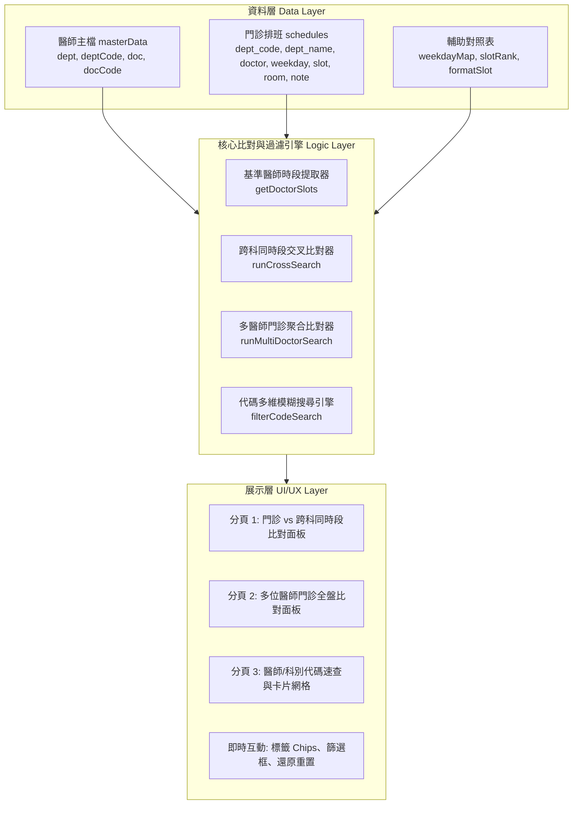

# 門診時段交叉查詢與醫師代碼查詢系統 - 專案紀錄 (Project Record)

---

## 1. 專案基本資訊 (Project Overview)

| 項目 | 內容 |
| :--- | :--- |
| **專案名稱** | 門診時段交叉查詢與醫師代碼查詢系統 (Outpatient Clinic Schedule Cross-Query & Doctor Code Assistant) |
| **專案代號** | `Clinic-Schedule-CrossQuery` |
| **建立日期** | 2026-09-18 |
| **目前版本** | `v0.9.0` (基準醫師加深為深墨海藍 #1E3545、改以科別區分色彩並納入 Morning Sky 與 Ocean Mist、其他醫師字體採用深藍石墨色 #0E4369、停診表分行置中、課表膠囊居中對齊) |
| **主要目標使用者** | 臨床醫師、門診跟診護理師、轉診中心個案管理師、批價掛號櫃檯人員、專科護理師 (NP)、各科行政秘書 |
| **運作環境** | 現代網頁瀏覽器 (Chrome, Edge, Safari, Firefox)、支援行動裝置 (RWD)、純前端零依賴離線運作 (Zero-dependency Web App) |
| **GitHub 倉庫** | `https://github.com/DAIDAI082340/OPD-schedule-and-Doctor-code` |
| **GitHub Pages 線上網址** | `https://daidai082340.github.io/OPD-schedule-and-Doctor-code/` |
| **專案路徑** | `c:\Users\X4715G\Desktop\Antigravity 專案\門診時段交叉查詢與醫師代碼查詢系統` |

---

## 2. 專案背景與核心目標 (Background & Objectives)

### 2.1 臨床背景與痛點說明
在大型醫療院所與醫院門診臨床運作中，醫護與行政人員常面臨以下挑戰：
1. **跨科轉診與會診難以即時對照**：
   - 當病人於 A 科就醫需要同日順道轉診或照會 B 科時，門診醫師或跟診人員往往需要翻閱厚重的紙本門診排班手冊或多頁 PDF，逐一核對「在我的門診時段，目標科別究竟是哪位醫師同時段有看診」，對照繁瑣且容易出錯。
2. **多位跨科醫師同日排程協同不易**：
   - 多科聯合會診或患者有多重慢性病需求時，需要協調 2 至 3 位特定醫師的排班重疊日（例如同時掛腎臟科與心臟科、或一般外科與大腸直腸外科），人工跨頁比對耗時費力。
3. **醫囑系統開立代碼翻查緩慢**：
   - 於 HIS 醫療資訊系統開立轉診單、照會單、檢驗檢查或辦理掛號時，需輸入醫師 4 碼代碼（如 0262）與科別代碼（如 AA、08 等），若手邊無即時快查工具，常中斷臨床作業流程。

### 2.2 系統核心目標
1. **某科別醫師門診 vs 其他科別同時段醫師秒級交叉查詢**：
   - 選定基準醫師後，系統立即抓取其每週所有看診時段（星期、上下夜診）。
   - 支援指定單一科別、全科、或多個目標醫師，即時列出同一時段內出診之醫師姓名、代碼、診間與備註。
2. **多位醫師門診全盤比對（依星期直覺聚合）**：
   - 提供多組科別及醫師選單或直接標籤勾選，一次比對 2 位以上醫師之每週排班。
   - 依星期一至六與時段自動聚合，即時標明「同時段看診 (N位)」綠色高亮或「單獨看診」。
3. **科別與醫師代碼雙向即時速查**：
   - 科別代碼快速展現全科醫師名單與代碼。
   - 提供全域關鍵字搜尋（輸入醫師姓名、醫師代碼或科別代碼立即過濾顯示卡片）。
4. **極致輕量、零後端依賴、單檔發行**：
   - 採純前端技術架構（HTML5/CSS3/Vanilla JS），不需架設 Node.js、資料庫或後端伺服器，可直接於院內內網、病房電腦或手機離線雙擊開啟使用。

---

## 3. 現有資產盤點與技術現狀 (Existing Assets & Current Status)

### 3.1 現有檔案清單
| 檔案名稱 | 類型 | 檔案大小 | 狀態與說明 |
| :--- | :---: | :---: | :--- |
| `門診時段交叉查詢與醫師代碼查詢系統.html` | 單檔應用程式 | 約 79 KB (1695 行) | 核心原型。內建完整 UI 介面、三大查詢分頁、`masterData`（86+ 位醫師主檔）與 `schedules`（完整門診排班時段陣列）。 |
| `PROJECT_RECORD.md` | 專案紀錄 | 新建 | 本專案紀錄文件，記錄專案全貌、規格架構、資料字典與演進歷程。 |

### 3.2 現有資料庫涵蓋規模盤點
目前 `門診時段交叉查詢與醫師代碼查詢系統.html` 已整理並收錄完整之科別與醫師主檔：
- **涵蓋科別（共 29 個科別代碼）**：
  - 腸胃內科 (`AA`)、心臟內科 (`AB`)、胸腔內科 (`AC`)、腎臟內科 (`AD`)、免疫風濕科 (`AE`)、血液腫瘤科 (`AF`)、感染科 (`AH`)、神經內科 (`12`)、新陳代謝科 (`0202`)、放射腫瘤科 (`FB`)、家醫科 (`01`)、心臟外科 (`BB`)、胸腔外科 (`BC`)、一般外科 (`03`)、大腸直腸外科 (`BA`)、神經外科 (`07`)、骨科 (`06`)、泌尿科 (`08`)、耳鼻喉科 (`09`)、整形外科 (`15`)、婦產科 (`05`)、高壓氧 (`0208`)、皮膚科 (`11`)、眼科 (`10`)、牙科 (`40`)、復健科 (`14`)、精神科 (`13`)、小兒科 (`04`)、中醫科 (`60`)。
- **醫師主檔 (`masterData`)**：86 筆以上醫師代碼與姓名對應，已校正最新醫師代碼（如 `(0262) 陳詩典`）。
- **門診排班 (`schedules`)**：包含數百個時段記錄，詳載星期（週一至週六）、時段（上午診、下午診、夜診）、診間號（如 `1樓11診`、`2樓88診`、`22診`）與特診備註（如 `肺癌特診`、`限約診`、`9/12.26` 等隔週看診條件）。

### 3.3 現有功能優勢與演進評估 (Gap Analysis)
- **優勢**：
  - 介面採用現代醫療清新色彩風格（深藍、海藍與白底），易讀性佳。
  - 交互功能完整，具備「搜尋清除並還原」、「已選取標籤刪除」、「即時響應式過濾」。
  - 時段正規化（已內建修正「夜診診」為「夜診」之容錯格式化）。
- **後續可持續升級方向**：
  1. **資料與介面解耦**：目前醫師主檔與門診時段直接寫死在 HTML 腳本中，後續可拆分獨立 `data/` 資料模組，便於每月定期替換排班表。
  2. **排班變更/輪替維護工具**：提供簡易的 JSON/CSV 匯入匯出或管理介面，讓行政人員可在不更動程式碼的情況下更新排班。
  3. **比對結果匯出/列印友善視圖**：提供比對結果「一鍵複製文字」或「列印/匯出圖片」功能，方便門診護理師貼入醫囑、轉診紀錄或印出給患者。
  4. **版本控管與線上預覽**：建立 Git 版本庫並支援 GitHub Pages 部署，方便院內醫護透過公網或院內瀏覽器即開即用。

---

## 4. 系統架構與技術選型 (System Architecture)



### 4.1 技術規範
- **核心架構**：單檔純前端應用 (Single-file Single Page Application)。
- **樣式規範**：原生 CSS3 Variables，彈性盒模型 (Flexbox) 與網格佈局 (CSS Grid)，完全適應手機直式與電腦寬螢幕。
- **資料處理**：ES6+ Map, Set, Array filter/reduce/sort，高效率純記憶體檢索，零延遲即時運算。
- **無依賴原則**：不依賴任何外部 CDN、外部字型或 NPM 套件，完全封裝於本地，防止因院內網路管制導致 CDN 斷線或版面破裂。

---

## 5. 資料結構規範 (Data Schema Specification)

### 5.1 醫師主檔資料規格 (`masterData`)
```javascript
{
  dept: "腸胃內科",       // 科別中文名稱
  deptCode: "AA",         // 科別代碼 (英數編碼)
  doc: "陳詩典",          // 醫師姓名
  docCode: "0262"         // 醫師代碼 (4碼字串，若無則為空字串)
}
```

### 5.2 門診排班資料規格 (`schedules`)
```javascript
{
  dept_code: "AD",        // 科別代碼
  dept_name: "腎臟內科",   // 科別中文名稱
  doctor: "黃耀宣",        // 醫師姓名
  weekday: 3,             // 星期 (整數: 1=週一, 2=週二, ..., 6=週六)
  slot: "夜診",           // 時段 ("上午" | "下午" | "夜診")
  room: "2樓88診",        // 診間名稱/位置編號
  note: ""                // 備註說明 (如 "限約診"、"肺癌特診"、"9/12.26" 等)
}
```

---

## 6. 核心功能模組規劃 (Feature Modules)

### 模組 1：某科別醫師門診時段 vs 其他科別同時段醫師查詢 (Cross-Department Matching)
- **步驟 1 - 選擇基準醫師**：下拉選擇科別後自動聯動醫師選單（顯示代碼），選定即設為基準醫師。
- **步驟 2 - 選擇比對目標**：
  - 下拉選單選擇目標科別與目標醫師（支援「-- 全科所有醫師 --」）。
  - 點選「＋ 加入比對名單」加入已選標籤池（支援一鍵 `✕` 移除標籤）。
  - 介面純化：精簡移除多餘的 Chips 勾選與搜尋欄，回歸最直覺清爽之雙選單操作。
- **比對運算與呈現**：
  - 提取基準醫師當週看診所有時段（依星期、時段先後排序）。
  - 對照目標科別或目標醫師於「完全相同之星期與時段」出診之名單。
  - 清楚列出出診醫師姓名、醫師代碼、科別代碼、診間與特診備註；若該時段無人出診則提示「所選目標於此時段無門診」。

### 模組 2：科別與醫師代碼速查模組 (Doctor & Department Code Lookup & Schedule Modal)
- **科別代碼索引**：下拉選單選取科別，立即顯示該科別代碼大標籤，並以網格卡片展開該科所有醫師及其 4 碼代碼。
- **全域即時搜尋**：輸入關鍵字（醫師姓名、代碼、科別名稱、科別代碼），無需手動觸發按鈕，即時顯示相符卡片；並提供「清除搜尋並還原」按鈕快速復原。
- **✨ 點選醫師展開門診時刻表 (Schedule Modal)**：
  - 點擊任何醫師卡片，立即以優雅浮層 (Modal) 展開該醫師當週所有門診時段。
  - 依週一至週六逐日呈現看診星期、上下夜診、診間號碼與特診備註。
  - 支援點選 `✕`、底部關閉按鈕、遮罩背景或按 `Esc` 鍵迅速關閉。

---

## 7. 專案開發時程與里程碑 (Roadmap & Milestones)

| 階段 | 里程碑目標 | 主要任務 | 狀態 |
| :---: | :--- | :--- | :--- |
| **Phase 1** | **專案建立與現狀資產盤點** | • 盤點原始代碼架構與功能<br>• 建立專案正式紀錄與規格書 (`PROJECT_RECORD.md`)<br>• Git 初始化並部署至 GitHub Pages | **已完成** |
| **Phase 2** | **介面精簡與時刻表彈窗功能** | • 精簡交叉比對介面（移除 Chips 與搜尋欄）<br>• 刪除多位醫師比對頁籤與後端冗餘邏輯<br>• 補齊神經內科羅健寧代碼 (`1212`)<br>• 實作代碼速查「點選醫師彈出門診時刻表」功能 | **已完成 (當前)** |
| **Phase 3** | **醫院掛號網站連線與自動更新** | • 研析衛福部彰化醫院網路掛號系統資料架構<br>• 規劃全院 29 科自動爬蟲與 GitHub Actions 每月排程自動更新機制 | **規劃中** |

---

## 8. 系統使用與資料維護注意事項 (Maintenance Guidelines)

> [!NOTE]
> **排班時效與特診備註維護原則**：
> 1. 門診排班若遇醫師請假、突發代診或國定假日停診，應以各院區現場公告與掛號系統即時排班為準。
> 2. 備註欄位標註有日期（如 `9/12.26`、`9/11`）代表特定週次或隔週開診，比對時需特別留意該備註提示。
> 3. 若新增醫師或修改醫師代碼，需同步確認 `masterData`（主檔）與 `schedules`（排班表）之醫師姓名完全一致，以確保代碼關聯與高亮功能正確運作。

---

## 9. 變更紀錄 (Changelog)

- **v0.4.2 (2026-09-18)**:
  - **🩺 補齊胸腔內科 高劍虹 醫師代碼**：
    - 將 `[AC] 胸腔內科` 高劍虹 醫師之代碼由空白補齊為 **`0036`**，即日起支援輸入 `0036` 快速檢索，卡片與時刻表亦同步標註。
  - **🎨 多醫師大色相互斥調色盤升級（徹底解決相近色混淆）**：
    - 全面剔除相鄰色，改採 8 大互斥色系（翡翠綠、活力橙、皇家深紫、石榴紅、焦糖棕、沉穩碳黑、電光天青、鮮亮洋紅）。
    - 徹底解決「深靛藍 vs 薰衣紫」偏紫藍撞色問題（改為碳黑 vs 正紫）。
- **v0.9.0 (2026-09-21)**:
  - **⚓ 基準醫師視覺再加深 (Deepen Base Doctor Background)**:
    - 基準醫師底色全面升級為沉穩深邃之 **`#1E3545`**（深墨海藍 Deep Slate Navy），邊框改為 `#132430`，搭配純白色高對比粗體字（`#ffffff`），在每週大課表頂部形成絕對清晰且具權威感之定錨基準。
  - **🏷️ 基準醫師「(基準)」標註規則精緻化 (Selective & Stacked Base Badge)**:
    - **全科基準隱藏**：當第一步驟基準選擇某科「-- 全科所有醫師 --」時，矩陣大課表膠囊、停診表格及圖例中的該科醫師一律不顯示 `(基準)`。
    - **單選特定醫師才顯示**：僅當使用者單選特定一位醫師作為基準時，膠囊才帶有 `(基準)`。
    - **停診表格姓名與基準分行置中**：停診表格「科別與醫師」單元格採垂直彈性居中排版，第一行為醫師姓名完整不折行、第二行 `(基準)` 分段向下居中放置，徹底杜絕手機版姓名被拆斷腰斬。
  - **🎨 色彩改以「科別」為單位區分 ＆ 導入植物物語淡彩盤 (Department-based Palette)**:
    - **科別代表色統一**：同一科別的所有醫師，統一共用該科專屬代表色；不同科別依加入順序輪流指派互斥色。
    - **納入最新色卡**：正式加入指定之 **Morning Sky 晨曦澄空藍 (`#D6E4FA`)** 與 **Ocean Mist 清透湖水青 (`#B7DCD6`)**。
    - **徹底移除易混淆之橄欖苔綠**：捨棄暗濁綠色，改採清新高明度淡彩（鼠尾草綠 `#D6EAD4`、櫻花粉 `#F7E1E6`、蜜桃粉 `#FFD6A5`、丁香紫 `#E6D6F7`、檸檬黃 `#FFF6D6`、珊瑚粉 `#FFB5A7`、金沙黃 `#F4D9A6`、沙色 `#EAD8B0`），色相反差鮮明、無撞色疑慮。
    - **其他醫師文字採用第 2 張圖深藍石墨色**：比對目標醫師字體全面改採第 2 張圖取樣之沉穩深藍色 **`#0E4369`**，在淡彩底色上文字對比度超越 8.5:1（大幅超越 WCAG AAA 標準）。
  - **📱 手機版門診大課表文字全面水平居中 (Centered Mobile Pill Typography)**:
    - `.matrix-doc-info` 改為彈性居中佈局（`flex-direction: column; align-items: center; text-align: center;`），多行膠囊（如 `蔡旻叡 (88診 / 代診)`、`林嶸洲 (1診 / 預約已額滿)`）文字內部完美幾何居中，消除靠左偏斜。
  - **⚠️ 停診提醒表格「網掛不開放」與「停診」自動分段分行並置中 (Split Stacked Suspension Badges)**:
    - 單元格設定為水平垂直雙居中對齊。
    - 若備註中同時包含「網掛不開放」與停診日期，系統自動結構化拆分為兩行獨立徽章：第一行 `⚠️ 網掛不開放`（柔和警告徽章）、第二行 `10/8 . 10/15 停診`（原子化防斷日期徽章），清爽易讀。
  - **🔒 雙生檔案 SHA-256 100% 位元級同步**：
    - `index.html` 與 `門診時段交叉查詢與醫師代碼查詢系統.html` 之 SHA-256 雜湊值維持 100% 相同。

- **v0.8.0 (2026-09-21)**:
  - **🌿 導入「Spring Meadow」自然草甸色彩池 (Spring Meadow Palette Integration)**:
    - **非寫死動態輪流分配 (Round-Robin)**：醫師顏色絕不固定綁定特定醫師，而是依使用者「加入比對名單的順序」動態輪流依序分配。
    - **基準醫師固定專屬色**：基準醫師固定指派深海藍湖水色 `#558E9B`（較深色底、純白色高對比字體 `#ffffff`），在全週大課表頂部形成絕對清晰之定位錨點。
    - **Spring Meadow 12 色色彩池陣列**：
      1. `#C96349`（磚紅珊瑚 Coral Terracotta）
      2. `#84A48B`（鼠尾草綠 Sage Leaf）
      3. `#A386A9`（紫丁香粉紫 Lilac Mist）
      4. `#88895B`（橄欖苔綠 Olive Moss）
      5. `#E89B88`（蜜桃珊瑚粉 Warm Peach）
      6. `#7BB2BA`（柔湖水藍 Spring Lake）
      7. `#A36361`（暖赤褐 Rosewood）
      8. `#C6B3CA`（粉紫灰 Dusky Heather）
      9. `#E7C676`（秋麥金黃 Soft Amber）
      10. `#AECBB8`（薄荷清綠 Celadon Mint）
      11. `#D1A996`（燕麥奶褐 Oat Milk）
      12. `#F79E70`（暖杏橙 Soft Apricot）
    - **標籤與大課表膠囊 100% 絕對連動**：上方「已加入標籤」與下方門診比對大課表、圖例列中之「醫師姓名框」，嚴格同步相同之分配色。
    - **嚴格符合 WCAG AA 4.5:1 無障礙閱讀標準**：深色膠囊配純白字、粉淺色膠囊配沉穩灰藍字（`#2c3e50`），兼顧頂級典雅美感與無懈可擊之易讀性。
  - **🎨 全站字體全面升級為灰藍色調 (Slate Gray-Blue Typography)**:
    - 頁面主要字體顏色、標籤文字、標題全面升級為沉穩灰藍色 **`#34495e`**。
    - 次要文字、備註與診間副標籤升級為柔和灰藍色 **`#5d6d7e`**。
    - 頂部導航列與深色漸層卡片維持純白（`#ffffff`）對比，層次分明、清新耐看。
  - **🩺 查詢彈性大幅提升：支援「基準全科」與「單選基準即時查詢」**:
    - **基準醫師支援選擇「-- 全科所有醫師 --」**：第 1 步驟選擇科別後（如腸胃內科），若選「-- 全科所有醫師 --」，系統自動以該科所有醫師作為基準，產出全科排班總覽，亦可與第 2 步驟進行跨科大對照。
    - **單選基準醫師不擋查詢**：若未在第 2 步驟加入任何比對目標，直接點擊「查詢」按鈕（或切換時）絕不彈出警告，而是直接流暢產出基準醫師／科別之每週門診大課表。
  - **雙生檔案一致性保證**：確保 `index.html` 與 `門診時段交叉查詢與醫師代碼查詢系統.html` 維持 100% SHA-256 雜湊值一致。

- **v0.7.6 (2026-09-21)**:
  - **📐 表格內醫師門診膠囊自動換行平起優化 (Flush Left Wrapped Doctor Pills)**:
    - **痛點根除**：解決先前因純文字串與置中對齊，在手機或窄欄寬度不足時，中文字與括號任意折行（如 `陳詩典 (2` 斷到第二行 `診)`、`林憲` 拆成 `治` 再拆成 `(18` 再拆成 `診)`）的混亂狀況。
    - **結構化語意重構**：將門診膠囊內部重構為 `.matrix-doc-info`，內含獨立之 `.matrix-doc-name`（醫師姓名，`white-space: nowrap`，絕對同行）與 `.matrix-doc-room`（診間號，`white-space: nowrap`，括號與診間完整同行）。
    - **絕對平起排版**：採用 `flex-direction: column; align-items: flex-start; text-align: left;`，保證姓名在上、診間在下，兩行左緣**絕對齊平（平起）**，右側整齊並列停診警示標籤（`⚠️ 停診`），電腦版與手機版全面達成與典範圖片（張之昀 6診）一致的高階醫療課表質感。
    - **圖例列與停診提醒表同步防斷**：醫師專屬圖例列的 `(基準)` 與提醒表診間號均加入原子防斷保護，防止字元被腰斬。
  - **📱 徹底解決手機版點擊下拉選單畫面暴跳問題 (Mobile Dropdown Tap Stabilization)**:
    - **痛點根除**：解決在手機觸控環境（如 iPhone Safari）下，使用者點選下拉選單時，畫面突然向下劇烈暴跳 200~300px，導致手指誤觸下方按鈕跳出警告或中斷原生滾輪選擇器的嚴重問題。
    - **觸控環境滾動豁免**：精準偵測行動觸控裝置（`pointer: coarse` 或 `ontouchstart`），徹底禁用干擾性 `scrollBy`，讓手機原生呼叫底部輪盤選單 (Bottom Sheet)，保持畫面絕對靜止穩定。
    - **移除干擾性自動滾動**：移除選定基準醫師後的 120ms 強制平滑滾動，杜絕使用者手勢與網頁程式競態衝突，讓手機版點選下拉選單順暢精準、穩若泰山。
  - **雙生檔案一致性保證**：確保 `index.html` 與 `門診時段交叉查詢與醫師代碼查詢系統.html` 維持 100% SHA-256 雜湊值一致。

- **v0.7.5 (2026-09-20)**:
  - **🏥 解決跨月門診診間異動之重複卡片問題（方案 B 執行）**:
    - **成因釐清**：張淑鈺醫師於 9 月份在 11診 看診，10 月份起院方掛號系統正式調整改為 88診；先前因自動爬蟲抓取未來數週時跨越 9~10 月，舊版以診間作為分組鍵值，誤將 11診 與 88診 判定為兩個同時存在的常規時段。
    - **當前排班修正（純維持 9 月現況）**：依使用者指示採方案 B，移除張淑鈺醫師於週二、週三上午多餘之 88診 項目，純粹維持 `11診`（不加額外備註），待 10 月份例行更新時再無縫切換為 88診。
    - **全資料庫排班單一性校驗**：經嚴格校驗，全院 86+ 位醫師在同科別、同星期、同時段之門診卡片達成 0 重複，徹底消除同一時段跳出兩個診間之異常。
  - **🤖 自動爬蟲腳本架構防呆升級 (`scripts/update_schedule.py` & `scripts/update_schedule.ps1`)**:
    - **主鍵重構**：將門診常規排班分組主鍵調整為 `(科別, 醫師, 星期, 時段)`，不包含診間，物理上保證同一醫師在同一時段絕不產出兩筆資料。
    - **跨月診間自動解析**：記錄每筆看診日期的診間紀錄，遇跨月調整診間時，自動選取最新月份之主要診間，確保每月最後一天執行更新時，全自動銜接新月份最新診間。
  - **雙生檔案一致性保證**：確保 `index.html` 與 `門診時段交叉查詢與醫師代碼查詢系統.html` 維持 100% SHA-256 雜湊值一致。

- **v0.7.4 (2026-09-20)**:
  - **🛡️ 停診日期原子換行保護機制 (Atomic Date Token Line-Breaking)**:
    - 解決連續日期在空間不足折行時將日期數字拆半（如 `10/20` 被截斷為第一行 `1`、第二行 `0/20停診`）的問題。
    - 建立 `formatSuspensionNoteHtml()` 函式，將各個獨立日期（如 `10/20停診`）包裹於 `.date-atomic`（`white-space: nowrap; display: inline-block;`），並在點號後插入語意化安全換行點 `<wbr>`。
    - 遇折行時一律精確在日期分隔點換行，將整顆日期完整落於下一行，確保所有日期 100% 完整無損呈現。
    - 全面套用於排班時刻表膠囊、頂部停診提醒表格與醫師門診彈窗。
  - **雙生檔案一致性保證**：確保 `index.html` 與 `門診時段交叉查詢與醫師代碼查詢系統.html` 維持 100% SHA-256 雜湊值一致。

- **v0.7.3 (2026-09-20)**:
  - **🔽 下拉式選單一律向下展開優化 (Enforce Downward Dropdown Expansion)**:
    - 解決第 2 步比對科別/醫師下拉選單在點擊時向上彈出、遮蔽標題與頂部書籤列的問題。
    - 將 `body` 之 `padding-bottom` 擴充至 `540px`，隨時保有超充裕向下捲動緩衝空間。
    - 升級 `initAntiUpwardDropdowns`，確保下方展開高度留有至少 `540px`（且下方空間遠大於上方空間），強制 Chromium 一律向下展開。
    - 在選定第 1 步基準醫師時，系統自動以平滑動態（`behavior: 'smooth'`）引導至第 2 步比對選單，使選單置於視窗上半部最佳視角，點開時自然向下展開。
  - **📅 停診日期標註取消縮寫、全面完整列出 (Fully List All Suspension Dates)**:
    - 取消原「近期停診(9/22等5診)」容易被誤認為「等待5診」的簡寫模式，全面改為直接完整列出所有具體日期。
    - 更新牙科黃惠娟醫師為 `9/22.9/29.10/6.10/13.10/20停診`、牙科鍾先揚醫師為 `9/25.10/2.10/9.10/16停診`。
    - 同步調整 `scripts/update_schedule.py` 自動爬蟲腳本，確保未來每月自動抓取更新時一律直接輸出完整具體日期。
  - **雙生檔案一致性保證**：確保 `index.html` 與 `門診時段交叉查詢與醫師代碼查詢系統.html` 維持 100% SHA-256 雜湊值一致。

- **v0.7.2 (2026-09-20)**:
  - **🩺 支援單選基準醫師即時查詢（Single Doctor Schedule View）**:
    - 解除過去必須先選擇第 2 步驟比對目標才能查詢的限制。只要選中基準醫師，立即自動展開其每週門診大課表、各時段診間與近期停診快訊表格。
    - 頂部資訊卡提供貼心提示：`💡 目前呈現基準醫師門診排班；如需跨科比對，可隨時於第 2 步驟選擇科別或醫師加入名單`。
    - 點選基準醫師下拉選單時即刻響應查詢，無需額外點擊查詢按鈕。
  - **📏 近期門診停診／異動提醒表格緊湊小巧化（Compact Suspension Table）**:
    - 儲存格上下內距縮緊為 `5px 10px`（垂直高度縮減約 45%），字級精緻化為 `0.85rem`。
    - 醫師膠囊改採精巧版（`.suspension-doc-pill`，字級 `0.84rem`），停診警示標籤調整為 `0.80rem`。
    - 整體快訊表格更為簡潔精緻、不搶佔大課表視覺焦點。

- **v0.7.1 (2026-09-20)**:
  - **🧹 官方停診公告彈窗精準化 (Official Notice Modal Refinement)**:
    - 排除官方公告專頁中之檔案小圖標與非公文大圖（剔除標題為 "1" 或檔名為 `0d49156d349d7fa0e223d371cc3cba4a` 之無效圖檔），並於更新腳本加入字串過濾防護。
    - 移除彈窗卡片之 `公告表件 (1/4) :` 編號前綴贅字，直接以完整公文標題（如：`115年09月醫師停代診公告`、`11510醫師停代診公告`）清晰呈現。
  - **📊 近期門診停診／異動提醒整合為「同醫師集中於同一表格區塊內」 (Grouped Suspension Table)**:
    - 徹底捨棄過去鬆散標籤排列方式，升級為結構嚴謹之響應式專屬表格 (`.suspension-table`)。
    - **同醫師跨時段合併呈現**：同醫師之多筆異動時段（如：週一上午、週五下午、週五夜診）自動合併於同一醫師欄位（`rowspan`），直覺掌握該醫師所有異動排程。
    - **醫師專屬色彩膠囊連動**：醫師欄位顯示與比對課表嚴格一致之金屬色徽章與科別，並支援點擊直接彈出該醫師完整門診課表。
    - **時段自動按星期與午別排序**：同一醫師底下之時段依週一至週六、上午/下午/夜診依序排序，資訊井然有序。

- **v0.7.0 (2026-09-20)**:
  - **🤖 每月最後一天自動排程更新系統 (Monthly Auto-Update CI/CD)**:
    - 建立 GitHub Actions 工作流程 `.github/workflows/monthly_schedule_update.yml`，於每月最後一日 UTC 15:00（台灣時間 23:00）定時觸發，支援 `workflow_dispatch` 手動觸發。
    - 建立 Python 3.11 更新腳本 `scripts/update_schedule.py` 與 PowerShell 腳本 `scripts/update_schedule.ps1`，具備 `--check-last-day` 與 `--dry-run` 彈性安全旗標。
    - 自動完成：抓取官方停代診公告、解析 4 位官方醫師代碼、遍歷全院 40 專科排班表、自動更新 HTML 資料並自動 git commit & push 至遠端倉庫。
  - **📋 官方停代診公告專頁 (`iid=15`) 整合與大圖燈箱彈窗 (Official Suspension Notice Modal)**:
    - 自動抓取衛生福利部彰化醫院官方停代診公告專頁 (`https://www.chhw.mohw.gov.tw/?aid=320&page_name=detail&iid=15`) 之公文大圖與標題。
    - 頂部導航列新增「📋 官方醫師停診、代診公告」按鈕與呼吸微光紅點 (`.notice-badge-dot`)。
    - 點擊彈出專屬燈箱視窗 (`#noticeModal`)，直覺檢視全院各月份官方停代診公文大圖並支援外開新視窗高解析度檢視。
  - **⚠️ 門診掛號即時停診日解析與醒目警示提醒 (Suspension Clinical Alerts)**:
    - 智慧擷取門診掛號系統之停診與停掛狀態，標註確切停診日期（如：`10/10停診`、`10/10.17停診` 或 `近期停診(9/25等4診)`）。
    - **頂部門診停診快訊卡片 (`.suspension-alert-banner`)**：於比對矩陣上方自動統整本次比對醫師的所有停診診次，提供橘紅高對比警示。
    - **矩陣內停診警示膠囊 (`.pill-suspension-badge`)**：矩陣醫師膠囊即時附加深紅警示標籤 `⚠️ [日期]停診`，一目了然。
    - **個人時刻表彈窗停診紅色框線與徽章**：個人門診彈窗遇停診診次以紅色邊框與 `⚠️ [日期]停診` 高亮。
  - **雙檔案一致性保證**：確保 `index.html` 與 `門診時段交叉查詢與醫師代碼查詢系統.html` 維持 100% SHA-256 雜湊值一致。

- **v0.6.0 (2026-09-20)**:
  - **🏛️ 介面全面升級：柔和金屬棕／香檳金色系風格 (Soft Metallic Bronze / Champagne Gold)**:
    - 介面主題色系全面轉換為奢華典雅之金屬棕與香檳金（#8c6d58、#ba9f84、#d4c2b0、#4a3728）。
    - 構建 **10 組建築礦物金屬色階色彩池**（黑曜深焙摩卡、璀璨香檳金、干邑赤銅紅、青銅古綠、焦糖暖琥珀、紫檀金屬褐、錫灰銀鈦、青金孔雀藍銅、燻烤杏仁奶金、粉漾玫瑰金），嚴格遵循互斥色相原則，全科比對時每一位個別醫師皆獲得獨一無二之專屬色彩。
  - **🛡️ 視窗防向上彈出機制 (Anti-Upward Dropdown Engine)**:
    - 解決下拉選單在螢幕底部因空間不足而強制往上彈出的問題，加入視窗動態滾動校正，一律強制向下展開。
  - **🔢 下拉式選單嚴格英數排序與全科所有醫師提示規範**:
    - 「科別與醫師代碼速查」與「門診時段交叉查詢」之科別下拉選單順序完全對齊（依代碼 01, 0202, 03... AA, AB... 升冪排列）。
    - 未選擇科別或醫師前，選單一律顯示 `-- 請選擇科別 --` 與 `-- 全科所有醫師 --`。

- **v0.5.1 (2026-09-18)**:
  - **🔍 全系統字體全面放大升級 (Font Size & Legibility Upgrade)**：
    - **基礎字級提升**：全站 body 設定 `16.5px`，整體基礎視覺等比強化。
    - **矩陣大課表核心字級放大**：
      - 醫師姓名與診間膠囊由 `0.86rem` 放大至 **`1.00rem`**（放大約 23%），內距擴增至 `7px 14px`。
      - 課表表頭（上午 / 下午 / 晚上）由 `0.94rem` 放大至 **`1.08rem`**。
      - 星期側欄（週一至週六）由 `0.96rem` 放大至 **`1.10rem`**。
      - 頂部醫師色彩圖例標題與標籤放大至 **`0.98rem`**。
    - **操作選單與按鈕放大**：
      - 科別與醫師下拉選單放大至 **`1.04rem`**，高度加高至 `46px`。
      - 操作按鈕（查詢、＋加入、清空）放大至 **`1.05rem`**。
      - 頂部頁籤切換鈕放大至 **`1.02rem`**。
    - **時刻表彈窗與代碼速查**：
      - 彈窗格內班次與診間放大至 **`1.02rem`**，彈窗標題放大至 **`1.22rem`**。
      - 醫師卡片姓名放大至 **`1.06rem`**，4 碼醫師代碼放大至 **`1.08rem`**。

- **v0.5.0 (2026-09-18)**:
  - **💎 全系統視覺質感升級：現代北歐精品醫學風 (Modern Nordic Clinical)**：
    - **星夜深邃曜石藍導航 (Header & Atmosphere)**：改採 `#0b132b` ~ `#1c2d4a` 深邃漸層，加入晶透光澤底線與精緻徽章 `✦ 臨床門診排班即時比對系統`，微字距排版體現高階醫療軟體質感。
    - **微浮雕光影與層次 (Elevation & Depth)**：卡片升級為柔白瓷面，搭配雙層微漫射柔和陰影與 `14px` 典雅圓角。
    - **每週矩陣時刻表極致美化 (Matrix Timetable Elegance)**：表頭改為冰晶鈦灰微漸層 (`#f8fafc` ~ `#edf2f7`)，格線維持深灰高對比 (`#94a3b8` / `#64748b` / `#cbd5e1`)，滑鼠懸停微泛柔光導引動線。
    - **醫師膠囊注入微立體浮雕感 (Refined Badges)**：為醫師標籤加入頂部高光光澤 (`inset 0 1px 0 rgba(255,255,255,0.7)`) 與懸停微浮動效，維持 8 大高對比無衝突互斥調色盤，兼具極致辨識度與頂級質感。
    - **深邃毛玻璃霧面彈窗 (Frosted Glass Modal)**：背景導入 `backdrop-filter: blur(8px)`，彈窗外框加入精緻微光邊界與絲滑淡入動畫。
  - **安全備份**：建立 Git 標籤 `v0.4.3-backup-before-revamp`，確保若不滿意隨時可一秒退回前版。

- **v0.4.3 (2026-09-18)**:
  - **✨ 跨科門診查詢與醫師時刻表彈窗全盤升級為「每週矩陣時刻表大課表」**：
    - 將比對結果由逐日卡片改為直覺大方的橫向「上午 / 下午 / 晚上」與縱向「星期」課表矩陣，全週排班一表掌握。
    - **時段標頭精簡化**：徹底移除 `(08:30~12:00)` 等時間贅字，純粹呈現「上午 / 下午 / 晚上」。
    - **多位醫師專屬調色盤（超過 3 位以上個別區分色彩）**：
      - 基準醫師固定為高對比深藍色純色膠囊。
      - 比對目標中出現的每位醫師（如神經外科賴肇康、張昕煥、趙紹清...等）自動指派互不重複之專屬色彩膠囊（綠、橙、紫、粉、青...）。
      - 表格上方自動生成專屬「醫師色彩圖例列」，點擊任一圖例或格內標籤皆可彈出該醫師每週排班表。
    - **無門診不呈現**：
      - 完全無診的星期整列不顯示，僅顯示有門診之工作日；格內若無門診則純留白，絕不呈現「(無門診)」字樣。
    - **格內極簡極致化**：格內僅呈現 `醫師姓名 (診間)`，不使用任何 Emoji 圖案干擾，純以顏色區分。
    - **🎨 區隔線高對比加深優化**：外框與縱向欄位線全面加深至 `#94a3b8`（1.5px），星期側欄加粗至 2px，表頭底線加深至 `#64748b`（2px），水平列線加深至 `#cbd5e1`，表格結構層次分明、大幅提升視覺辨識度。
  - **✨ 個人時刻表彈窗同步矩陣化**：
    - 改為週一至週六 × 上午/下午/晚上 矩陣，上午（藍）、下午（橙）、夜診（紫）三色獨立卡片，移除「N個看診時段」字眼，空格純留白。

- **v0.3.1 (2026-09-18)**:
  - **✨ 跨科門診查詢依「星期」完整聚合，解決同天多時段拆散問題**：
    - 重構比對迴圈演算法，改採 `slotsByWeekday` 依看診星期聚合。同一工作日僅產出一張卡片，頂部標頭完整彙整該日基準班次（如：下午診 ｜ 夜診）。
    - 徹底解決如「蔡旻叡 vs 蔡卓榮在週五下午與夜診皆有門診，過去卻被拆成兩張卡片互相被指為不同時段」的邏輯盲點。
  - **🎨 查無結果全面無色化**：
    - 同時段無門診時，完全隱藏綠色區塊；同日不同時段無門診時，完全隱藏黃色區塊。
    - 當日目標完全無門診時，僅以極簡淡灰底文字呈現中立提示，絕不產生任何綠色或黃色色彩外框。
  - **🧹 去除冗長重複說明**：
    - 刪除括號中繁瑣的「可同半天接續就醫」、「病患當天跑一趟醫院」等冗言，版面回歸乾淨俐落。

- **v0.3.0 (2026-09-18)**:
  - **✨ 跨科門診查詢升級為「同天同時段 ＆ 同天不同時段」雙層完整呈現**：
    - 突破過去僅能查詢完全重疊時段之侷限，在基準醫師看診的每個工作日，自動展開「🟢 同天同時段出診（可同半天接續就診）」與「🟡 同天不同時段出診（可同天跨上午/下午/夜診就診）」兩大區塊。
    - 徹底解決病患同日跨科就醫排程需求，消除排程盲點。
    - 查詢結果中所有醫師標籤皆支援點擊直接彈出該醫師每週時刻表彈窗。
  - **同步部署**：
    - 同步更新 `index.html` 與 `README.md`，推送至 GitHub Pages 發布最新版。
  - **介面精簡優化**：
    - 刪除功能 1「搜尋醫師姓名、科別：」輸入欄位與還原按鈕。
    - 刪除功能 1「或直接勾選科別/醫師加入：」多選 Chips 欄位與相關 JS 函式。
  - **模組整併瘦身**：
    - 完全移除原功能 2「多位醫師門診全盤比對（依星期呈現）」頁籤按鈕、DOM 面板與 12 個關聯 JS 函式，系統精簡為兩大核心頁籤。
  - **資料修正與補齊**：
    - 補齊神經內科醫師 **羅健寧** 之醫師代碼為 **`1212`**。
  - **✨ 新增醫師門診時刻表彈窗**：
    - 代碼速查卡片支援 hover 陰影與手勢，並加入「📅 查看門診 ❯」引導提示。
    - 點選任何醫師卡片即可彈出該醫師每週門診時刻表（含看診星期、上下夜診、診間與特診備註），支援 Esc 快捷關閉。
  - **版本同步與部署**：
    - 同步更新 `index.html`，推送至 GitHub 觸發 GitHub Pages 即時生效。

- **v0.1.0 (2026-09-18)**:
  - 正式建立專案紀錄檔案 `PROJECT_RECORD.md` 與入門指引 `README.md`。
  - 完成現有 `門診時段交叉查詢與醫師代碼查詢系統.html` 原始檔案與功能盤點（三大查詢頁籤、29 個科別、86+ 位醫師主檔、數百筆門診時段）。
  - 確立三大核心模組規格（跨科同時段比對、多醫師星期聚合比對、科別與醫師代碼速查）。
  - 建立入口首頁 `index.html`，具備 GitHub Pages 靜態託管規格相容性。
  - 完成 Git 本地倉庫初始化 (`main` 分支) 並配置 `.gitignore`。
  - 連接 GitHub 遠端倉庫 `DAIDAI082340/OPD-schedule-and-Doctor-code` 並啟用 GitHub Pages 線上服務。
