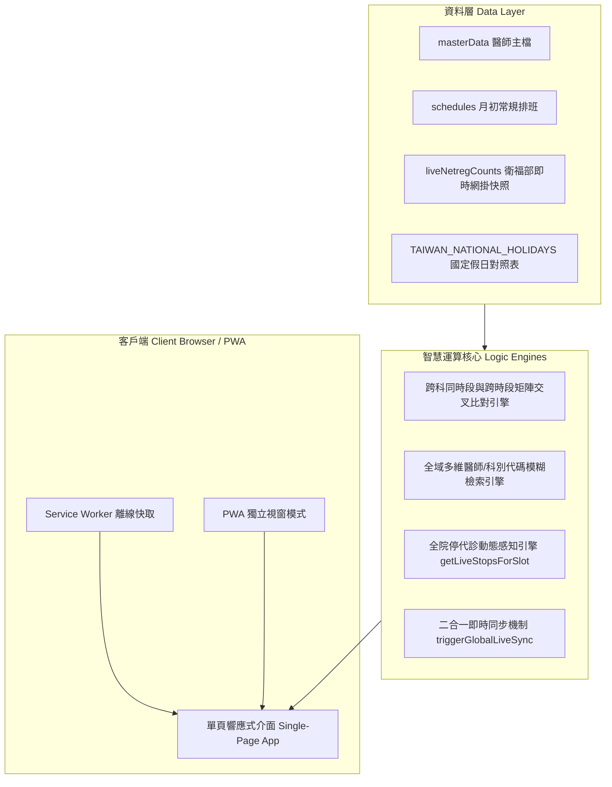

# 🏥 門診時段交叉查詢與醫師代碼查詢系統
> **Outpatient Clinic Schedule Cross-Query & Doctor Code Assistant**  
> 專為大型醫療院所臨床醫師、門診跟診護理師、轉診中心個管師、批價掛號櫃檯人員與行政同仁打造之智慧排班交叉檢索與即時停代診感知系統。


---

## 🌐 線上系統與立即體驗 (Live Demo)

- **線上系統網址（GitHub Pages 秒開）**：[https://daidai082340.github.io/OPD-schedule-and-Doctor-code/](https://daidai082340.github.io/OPD-schedule-and-Doctor-code/)
- **GitHub 專案倉庫**：[https://github.com/DAIDAI082340/OPD-schedule-and-Doctor-code](https://github.com/DAIDAI082340/OPD-schedule-and-Doctor-code)
- **支援平台**：桌面瀏覽器 (Chrome, Edge, Safari, Firefox)、平板與智慧型手機 (iOS Safari PWA, Android Chrome PWA)。

---

## 🚀 核心亮點與特色 (Key Features)

### 1. 門診跨科每週大課表交叉比對 (Cross-Department Matrix)
- **直覺矩陣視圖**：橫向「上午 / 下午 / 晚上」× 縱向「出診星期」，全週排班一目瞭然。
- **基準與多目標色彩分離**：基準醫師採用沉穩深墨青海藍（`#284E59`），比對目標醫師群自動獲配彩虹馬卡龍色彩池純色膠囊，支援多科、多人同時段與跨時段立體對照。
- **無診純留白**：無門診之星期整列自動隱藏，維持臨床最高視覺信噪比。

### 2. 首頁一鍵「即時同步官方數據」與停代診感知引擎 (Live Sync Engine)
- **免跳轉即時同步**：首頁頁籤列右側垂直堆疊「📋 官方醫師停診、代診公告」與「🔄 即時同步官方數據」（比照同款微光淺灰象牙漸層底色 `#f8fafc`～`#eef3f6`），點擊後全院 296 個時段的人數與快訊原地秒級刷新。
- **李學林 10/10「疊加新增停診標籤」**：確認排班邏輯為「月初排班備註保留，官方後續改為停診」，系統自動上層疊加新增 `⚠️ 10/10停診`，下層保留 `📅 10/10.10/24看診`，全院 6 位同類異動醫師通用支援。
- **全院停診稽核快訊**：首頁底部「📢 門診停診及異動」表格即時收錄所有動態停診資訊。

### 3. 國定假日停診動態感知與圖 1 標準格式回歸
- **大課表去化贅詞**：星期五晚上或國定假日夜診欄位精確呈現為 **「⚠️ 10/09 國定假日停診」**（夜診二字不重複出現，膠囊適中俐落）。
- **彈窗一個月掛號清單**：國定假日停診行（如 `10/09(W5)`）100% 比照圖 1 標準格式，日期深海藍（`#0E5E6F`，900 粗體），後方紅字寫「國定假日停診」，**零外框、無底色**，雙欄段落維持嚴格齊頭對齊。

### 4. 醫師/科別代碼雙向即時檢索 (Doctor & Dept Code Search)
- 涵蓋全院 39 個科別代碼（如 AA、AB、AC、AD、01、03、06、08、12、13、40、60... 等）。
- 收錄 88 位以上醫師 4 碼代碼主檔（如 `(0262) 陳詩典`、`(1212) 羅健寧` 等），支援全域模糊搜尋。
- 點擊任一醫師卡片立即彈出「個人每週時刻表彈窗」，支援查詢接下來一個月已掛號人數與即時連線刷新。

### 5. 官方醫師停代診公文大圖閱讀器 (Official Notice Viewer)
- 支援高清平移與縮放（拖曳平移、滑鼠滾輪垂直滾動、雙擊縮放）。
- 智慧比例感知：長篇密集表格（如 11510）自動以 **300%** 滿版置頂展開；橫式短篇公文維持 **100%** 原圖比例。

### 6. PWA 手機獨立 App 體驗 (Progressive Web App)
- 支援 Web App Manifest 與 Service Worker 快取機制。
- 在手機或桌面點擊「安裝 App」或「加入主畫面」，即可獲得全螢幕獨立 App 體驗，無網址列干擾，離線秒開。

---

## 🎨 專案視覺風格與品牌標誌規範 (Brand DNA)

本專案完全嚴格遵循 **「3D 浮雕微光金框卉字」** 品牌視覺設計規範：

1. **黃金立體邊框 (3D Brushed Gold Squircle Frame)**：
   - 滿版立體拉絲黃金圓角框，具備高光倒角與立體陰影。
2. **3D 浮雕微光風格 (Tactile 3D Embossed Style)**：
   - 底座：暖象牙亞麻紙紋／微光布紋肌理（`#FAF8F5`）。
   - 雕刻：湖水青瓷深綠（`#2D5A5B`）皮革微浮雕質感。
   - 元素：立體放大鏡（內嵌勾選與衝刺箭頭）＋時鐘排班矩陣＋環形網絡節點。
3. **右下角「卉」字品牌圖騰 (The "卉" Botanical Medical Emblem)**：
   - 象徵生機蓬勃、草木長青、仁心濟世。
4. **工程排版零折行規範**：
   - 排班膠囊、標籤與醫師代碼文字強制 `white-space: nowrap !important; word-break: keep-all !important;`，絕無不雅斷行拆字。

---

## 📂 專案目錄結構 (Project Directory Layout)

```text
門診時段交叉查詢與醫師代碼查詢系統/
├── index.html                       # 系統主入口（現代 PWA 單頁應用，相容 GitHub Pages 線上秒開）
├── 門診時段交叉查詢與醫師代碼查詢系統.html # 系統離線雙生檔（與 index.html 100% SHA-256 吻合）
├── manifest.json                    # PWA 應用程式設定檔（手機安裝獨立 App 規格）
├── sw.js                            # PWA Service Worker 離線快取與背景同步引擎 (v1.1.0)
├── icon-192.png                     # PWA 應用程式圖示 (192x192)
├── icon-512.png                     # PWA 應用程式圖示 (512x512)
├── apple-touch-icon.png             # iOS 桌面啟動圖示
├── live_registration.json           # 衛福部即時掛號人數與最新停代診快訊快照庫
├── 一鍵更新全院排班.bat              # 自動化更新排班與官方掛號數據批次檔
├── README.md                        # 專案公開說明書與快速入門手冊
├── PROJECT_RECORD.md                # 完整專案歷史里程碑與核心架構規格手冊 (v1.1.0)
├── DESIGN_PALETTE_SPEC.md           # 介面色系與色彩卡池規範說明書
├── GEMINI.md                        # 全域品牌視覺標準規範
├── .gitignore                       # Git 忽略設定
├── BRAND_ASSETS/                    # 品牌視覺設計母檔 (3D拉絲金框卉字 Logo)
│   └── logo_master_1024.png
├── docs/                            # 系統文檔與審計稽核報告
│   ├── hospital_wide_stop_audit_report.md
│   ├── full_system_audit_report.json
│   └── audit_results.json
├── scripts/                         # 排程與維護腳本工具
│   ├── get_hsiao.ps1
│   └── get_mon_pm.ps1
└── archive/                         # 歷程素材、設計草稿與原型封存
    ├── references/                  # 官方參考圖表、公文色卡與 LINE 截圖
    ├── mockups/                     # 手機螢幕視覺原型與圖標備份
    └── prototypes/                  # 開發階段組件與科別網頁原始碼
```

---

## 🛠️ 雙檔案一致性法則 (Dual-File Integrity Rule)

本專案遵循雙生檔案發行原則：
- `index.html`：供 GitHub Pages 雲端託管與現代瀏覽器直接讀取。
- `門診時段交叉查詢與醫師代碼查詢系統.html`：供院內醫護同仁隨身隨碟複製、離線點擊執行。
- **驗證規範**：兩者之 SHA-256 雜湊碼必須 **100% 絕對完全吻合**。每次發布前均自動執行雜湊校驗。

---

## 📖 系統架構圖 (System Architecture)



---

## 📄 授權與宣告 (License & Notice)

本系統為衛生福利部彰化醫院臨床與行政輔助作業打造，以提升醫療照護協同效率為核心宗旨。排班數據以院方官方即時網掛與公告公文為準。

---
*專案負責維護：臨床資訊與門診照護協同專案小組*  
*最新版本：`v1.1.0` (2026-09-30)*
